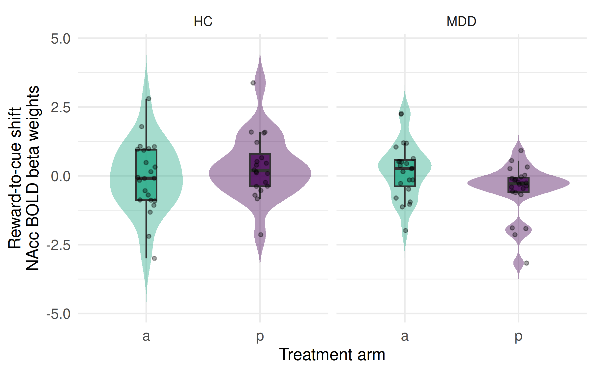
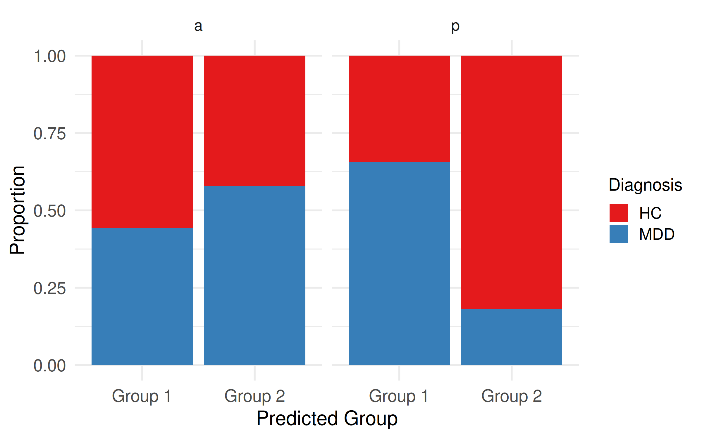
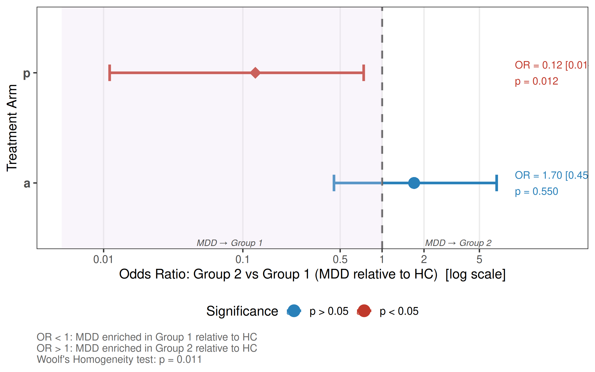

Multimodal Reward Learning in MDD patients
================

- [What this is](#what-this-is)
- [Packages](#packages)
- [1. Load data](#1-load-data)
- [2. Select ROI BOLD columns (Cue + Feedback ×
  blocks)](#2-select-roi-bold-columns-cue--feedback--blocks)
- [3. Long format & label phase, reward, block,
  ROI](#3-long-format--label-phase-reward-block-roi)
- [4. Compute reward modulation (Large/Medium/Small −
  Neutral)](#4-compute-reward-modulation-largemediumsmall--neutral)
- [5. Build SHIFT (CUE − FEED) for Large-Neutral
  Contrast](#5-build-shift-cue--feed-for-large-neutral-contrast)
- [6. Feature matrix for clustering (SHIFT_Accumbens across
  blocks)](#6-feature-matrix-for-clustering-shift_accumbens-across-blocks)
- [7. Consensus clustering](#7-consensus-clustering)
- [8. Mixed model](#8-mixed-model)
- [9. Validation metrics + silhouette
  plot](#9-validation-metrics--silhouette-plot)
- [10. Trajectories plot](#10-trajectories-plot)
- [11. Save outputs](#11-save-outputs)
- [11. PET analyses](#11-pet-analyses)
- [12. Save outputs](#12-save-outputs)
- [13. Cluster predictability (multinomial
  models)](#13-cluster-predictability-multinomial-models)
- [14. Apply clustering model to the independent MDD-HC
  dataset](#14-apply-clustering-model-to-the-independent-mdd-hc-dataset)
- [14a. Train final model and apply to new
  data](#14a-train-final-model-and-apply-to-new-data)
- [14b. ANCOVA: SHIFT_Accumbens ~ diagnosis ×
  treatment](#14b-ancova-shift_accumbens--diagnosis--treatment)
- [14c. Violin plot: SHIFT_Accumbens by treatment and
  diagnosis](#14c-violin-plot-shift_accumbens-by-treatment-and-diagnosis)
- [14d. Predicted group distribution by diagnosis and
  treatment](#14d-predicted-group-distribution-by-diagnosis-and-treatment)
- [14e. Fisher’s Exact Tests and OR homogeneity (Woolf’s
  test)](#14e-fishers-exact-tests-and-or-homogeneity-woolfs-test)
- [14f. Forest plot of ORs by treatment
  arm](#14f-forest-plot-of-ors-by-treatment-arm)

## What this is

This README is auto-generated from `analysis.Rmd` by GitHub Actions. It
loads **repo-local** data from `data/tabulated_data.csv` and runs
preprocessing + clustering.

## Packages

``` r
library(readr)
library(dplyr)
library(tidyr)
library(ggplot2)
library(viridis)
library(broom)
library(stringr)
library(purrr)
library(mclust)
library(patchwork)
library(lmerTest)
library(lme4)
library(emmeans)

# clustering + validation + plotting helpers
library(ConsensusClusterPlus)
library(cluster)       # silhouette()
library(fpc)           # cluster.stats() 
library(factoextra)    # fviz_silhouette()
```

## 1. Load data

``` r
data_path <- "data/tabulated_data.csv"

stopifnot(file.exists(data_path))

df <- readr::read_csv(data_path, show_col_types = FALSE) %>%
  mutate(ID = as.character(ID))

# quick check
dplyr::glimpse(df)
```

    ## Rows: 57
    ## Columns: 39
    ## $ ...1                                     <dbl> 1, 2, 3, 4, 5, 6, 7, 8, 9, 10…
    ## $ ID                                       <chr> "1", "2", "3", "4", "5", "6",…
    ## $ Gender                                   <chr> "male", "female", "male", "ma…
    ## $ Age                                      <dbl> 20, 20, 25, 21, 41, 20, 25, 2…
    ## $ Placebo1_Med0                            <dbl> 0, 1, 1, 1, 1, 1, 0, 1, 1, 1,…
    ## $ Accumbens_neutral_cue_block1             <dbl> 0.12972732, 0.60037232, 0.430…
    ## $ Accumbens_neutral_cue_block2             <dbl> 0.45606132, -1.94993732, 0.10…
    ## $ Accumbens_neutral_cue_block3             <dbl> -2.55305832, -0.27040532, -1.…
    ## $ Accumbens_neutral_cue_block4             <dbl> -1.78331332, 1.10315432, 0.22…
    ## $ Accumbens_small_cue_block1               <dbl> 0.97013332, -0.13071732, -0.3…
    ## $ Accumbens_small_cue_block2               <dbl> 0.69092932, -1.98736732, -0.5…
    ## $ Accumbens_small_cue_block3               <dbl> -0.86192832, 0.31881332, -0.3…
    ## $ Accumbens_small_cue_block4               <dbl> -2.3884963, 1.2862543, 0.8822…
    ## $ Accumbens_medium_cue_block1              <dbl> 0.88436832, 0.55068832, -0.46…
    ## $ Accumbens_medium_cue_block2              <dbl> 1.24813632, -1.73516632, -0.4…
    ## $ Accumbens_medium_cue_block3              <dbl> -1.38070132, -0.40730632, 0.1…
    ## $ Accumbens_medium_cue_block4              <dbl> -1.37276232, 1.61526632, 0.78…
    ## $ Accumbens_large_cue_block1               <dbl> -0.06297132, -1.47909832, 0.0…
    ## $ Accumbens_large_cue_block2               <dbl> -0.18494932, -2.65938832, -0.…
    ## $ Accumbens_large_cue_block3               <dbl> -1.39582932, 0.21508632, -1.2…
    ## $ Accumbens_large_cue_block4               <dbl> -1.18746932, 2.11181532, 1.22…
    ## $ Accumbens_neutral_FB_block1              <dbl> 2.39798032, 0.25903132, 0.724…
    ## $ Accumbens_neutral_FB_block2              <dbl> -0.43400832, -0.41715232, 1.0…
    ## $ Accumbens_neutral_FB_block3              <dbl> -0.02126332, 1.16361732, -0.1…
    ## $ Accumbens_neutral_FB_block4              <dbl> 0.11647532, 0.80733132, 0.719…
    ## $ Accumbens_small_FB_block1                <dbl> 2.57384432, 1.08259332, 1.546…
    ## $ Accumbens_small_FB_block2                <dbl> 0.95018132, -0.89703732, 0.43…
    ## $ Accumbens_small_FB_block3                <dbl> -1.0461243, 1.2120623, 0.1873…
    ## $ Accumbens_small_FB_block4                <dbl> -0.24037832, 1.01071632, 0.95…
    ## $ Accumbens_medium_FB_block1               <dbl> 1.38296332, 2.16054532, 1.121…
    ## $ Accumbens_medium_FB_block2               <dbl> 1.39321532, 0.58737432, 0.716…
    ## $ Accumbens_medium_FB_block3               <dbl> -0.21955932, -0.34362632, -0.…
    ## $ Accumbens_medium_FB_block4               <dbl> 0.10481132, 1.13842432, 1.087…
    ## $ Accumbens_large_FB_block1                <dbl> 1.6383273, 3.6799923, 0.97255…
    ## $ Accumbens_large_FB_block2                <dbl> 1.09787632, 1.49345332, 0.973…
    ## $ Accumbens_large_FB_block3                <dbl> 0.99669532, 0.90392232, -0.39…
    ## $ Accumbens_large_FB_block4                <dbl> 0.36977032, 1.04054032, 0.502…
    ## $ PET_BP_Session1_Accumbens_Winsorize      <dbl> 2.842319, 3.185009, 1.562276,…
    ## $ PET_Gamma_divided_k2a_Session1_Accumbens <dbl> 0.165488, 0.283617, 0.123568,…

## 2. Select ROI BOLD columns (Cue + Feedback × blocks)

``` r
df_roi <- df %>%
  select(
    ID, Gender, Age, Placebo1_Med0,
    matches("(Accumbens)_(small|medium|large|neutral)_(cue|FB)_block\\d+")
  ) %>%
  select(-matches("Session"))

id_vars <- c("ID", "Gender", "Age", "Placebo1_Med0")
roi_cols <- setdiff(names(df_roi), id_vars)

winsorize_iqr <- function(x) {
  q1 <- quantile(x, 0.25, na.rm = TRUE)
  q3 <- quantile(x, 0.75, na.rm = TRUE)
  iqr <- q3 - q1
  lower <- q1 - 1.5 * iqr
  upper <- q3 + 1.5 * iqr
  x[x < lower] <- lower
  x[x > upper] <- upper
  x
}

df_roi_wins <- df_roi %>%
  mutate(across(all_of(roi_cols), winsorize_iqr)) %>%
  mutate(across(all_of(roi_cols), ~ .x - mean(.x, na.rm = TRUE)))
```

## 3. Long format & label phase, reward, block, ROI

``` r
df_long <- df_roi_wins %>%
  pivot_longer(
    cols = -c(ID, Gender, Age, Placebo1_Med0),
    names_to = "tmp",
    values_to = "BOLD"
  ) %>%
  mutate(
    Reward = str_extract(tmp, "(small|medium|large|neutral)"),
    Block  = str_extract(tmp, "(?<=block)\\d+"),
    Phase  = case_when(
      str_detect(tmp, "_cue_") ~ "CUE",
      str_detect(tmp, "_FB_")  ~ "FEED",
      TRUE ~ NA_character_
    ),
    ROI = case_when(
      str_detect(tmp, "Accumbens") ~ "Accumbens",
      TRUE ~ NA_character_
    )
  ) %>%
  select(ID, Gender, Age, Placebo1_Med0, Reward, Block, ROI, Phase, BOLD)
```

## 4. Compute reward modulation (Large/Medium/Small − Neutral)

``` r
df_diff <- df_long %>%
  group_by(ID, Block, ROI, Phase, Placebo1_Med0) %>%
  summarise(
    BOLD_Large_vs_Neutral  = BOLD[Reward == "large"][1]  - BOLD[Reward == "neutral"][1],
    BOLD_Medium_vs_Neutral = BOLD[Reward == "medium"][1] - BOLD[Reward == "neutral"][1],
    BOLD_Small_vs_Neutral  = BOLD[Reward == "small"][1]  - BOLD[Reward == "neutral"][1],
    .groups = "drop"
  ) %>%
  left_join(df_long %>% distinct(ID, Age, Gender), by = "ID") %>%
  select(
    ID, Gender, Age, Placebo1_Med0, Block, ROI, Phase,
    BOLD_Large_vs_Neutral, BOLD_Medium_vs_Neutral, BOLD_Small_vs_Neutral
  )
```

## 5. Build SHIFT (CUE − FEED) for Large-Neutral Contrast

``` r
df_indv <- df_diff

df_diff_phases <- df_indv %>%
  select(ID, ROI, Block, Phase, BOLD_Large_vs_Neutral) %>%
  pivot_wider(names_from = Phase, values_from = BOLD_Large_vs_Neutral) %>%
  mutate(SHIFT = CUE - FEED)

df_diff_roi <- df_diff_phases %>%
  pivot_wider(names_from = ROI, values_from = c(CUE, FEED, SHIFT)) %>%
  mutate(subject = as.character(as.numeric(as.factor(ID)))) %>%
  left_join(df %>% mutate(subject = as.character(as.numeric(as.factor(ID)))) %>% select(subject, Age, Gender),
            by = "subject") %>%
  mutate(
    Block = as.numeric(as.character(Block)),
    subj  = factor(as.numeric(as.factor(ID)))
  )

stopifnot("SHIFT_Accumbens" %in% names(df_diff_roi))
```

## 6. Feature matrix for clustering (SHIFT_Accumbens across blocks)

``` r
features <- cbind(
  Block1 = df_diff_roi$SHIFT_Accumbens[df_diff_roi$Block == 1],
  Block2 = df_diff_roi$SHIFT_Accumbens[df_diff_roi$Block == 2],
  Block3 = df_diff_roi$SHIFT_Accumbens[df_diff_roi$Block == 3],
  Block4 = df_diff_roi$SHIFT_Accumbens[df_diff_roi$Block == 4]
)

subject_ids <- unique(df_diff_roi$ID)
features_scaled <- as.data.frame(scale(features))
rownames(features_scaled) <- subject_ids
features_scaled <- features_scaled[complete.cases(features_scaled), , drop = FALSE]
```

## 7. Consensus clustering

``` r
set.seed(234)
cons_results <- ConsensusClusterPlus(
  t(features_scaled),     # features x samples
  maxK = 6,
  reps = 200,             # keep Actions reasonably fast
  seed = 234,
  plot = "png",
  title = "figs/Consensus_Clustering",
  writeTable = FALSE
)

K_FINAL <- 3
final_clusters <- cons_results[[K_FINAL]]$consensusClass

df_with_clusters <- df_diff_roi %>%
  distinct(ID, Age, Gender) %>%
  mutate(cluster = final_clusters[match(ID, rownames(features_scaled))])

df_diff_roi_clustered <- df_diff_roi %>%
  left_join(df_with_clusters %>% select(ID, cluster), by = "ID") %>%
  mutate(
    Block = factor(Block),
    cluster = factor(cluster)
  )
```

## 8. Mixed model

``` r
fit <- lmer(SHIFT_Accumbens ~ cluster * Block + Age + Gender + (1|subject),
            data = df_diff_roi_clustered)
anova(fit)
```

    ## Type III Analysis of Variance Table with Satterthwaite's method
    ##                Sum Sq Mean Sq NumDF DenDF F value Pr(>F)    
    ## cluster         2.298  1.1488     2    52  1.3220 0.2754    
    ## Block           5.516  1.8386     3   162  2.1159 0.1003    
    ## Age             0.733  0.7326     1    52  0.8430 0.3628    
    ## Gender          0.006  0.0065     1    52  0.0075 0.9315    
    ## cluster:Block 120.113 20.0188     6   162 23.0373 <2e-16 ***
    ## ---
    ## Signif. codes:  0 '***' 0.001 '**' 0.01 '*' 0.05 '.' 0.1 ' ' 1

``` r
# Estimated marginal means
emm <- emmeans(fit, ~ cluster * Block)
pairs(emmeans(fit, ~ cluster | Block))
```

    ## Block = 1:
    ##  contrast            estimate    SE  df t.ratio p.value
    ##  cluster1 - cluster2    1.638 0.311 201   5.271 <0.0001
    ##  cluster1 - cluster3   -0.576 0.338 202  -1.704  0.2062
    ##  cluster2 - cluster3   -2.213 0.369 201  -5.991 <0.0001
    ## 
    ## Block = 2:
    ##  contrast            estimate    SE  df t.ratio p.value
    ##  cluster1 - cluster2   -0.609 0.311 201  -1.959  0.1251
    ##  cluster1 - cluster3   -1.807 0.338 202  -5.348 <0.0001
    ##  cluster2 - cluster3   -1.198 0.369 201  -3.242  0.0040
    ## 
    ## Block = 3:
    ##  contrast            estimate    SE  df t.ratio p.value
    ##  cluster1 - cluster2    0.654 0.311 201   2.106  0.0911
    ##  cluster1 - cluster3    1.929 0.338 202   5.710 <0.0001
    ##  cluster2 - cluster3    1.275 0.369 201   3.450  0.0020
    ## 
    ## Block = 4:
    ##  contrast            estimate    SE  df t.ratio p.value
    ##  cluster1 - cluster2   -1.379 0.311 201  -4.440 <0.0001
    ##  cluster1 - cluster3   -0.607 0.338 202  -1.798  0.1729
    ##  cluster2 - cluster3    0.772 0.369 201   2.090  0.0945
    ## 
    ## Results are averaged over the levels of: Gender 
    ## Degrees-of-freedom method: kenward-roger 
    ## P value adjustment: tukey method for comparing a family of 3 estimates

## 9. Validation metrics + silhouette plot

``` r
final_sil <- silhouette(as.integer(final_clusters), dist(features_scaled))
final_avg_sil <- mean(final_sil[, 3])

final_avg_sil
```

    ## [1] 0.234297

``` r
sil_plot <- fviz_silhouette(final_sil) +
  scale_fill_manual(values = c("#440154FF", "#22A884FF", "#D55E00"), name = "Group") +
  scale_color_manual(values = c("lightpink", "lightcyan", "orange"), name = "Group") +
  labs(title = paste("Silhouette Plot for K =", K_FINAL),
       subtitle = paste("Average Silhouette Width =", round(final_avg_sil, 3)))
```

    ##   cluster size ave.sil.width
    ## 1       1   27          0.26
    ## 2       2   17          0.14
    ## 3       3   13          0.30

``` r
sil_plot
```

<!-- -->

``` r
ggsave("figs/silhouette_plot_final.png", sil_plot, width = 10, height = 6)
```

## 10. Trajectories plot

``` r
df_diff_roi_clustered$Group <- df_diff_roi_clustered$cluster
# Compute cluster sizes (needed for facet labels)
cluster_sizes <- df_diff_roi_clustered %>%
  dplyr::distinct(ID, Group) %>%
  dplyr::count(Group, name = "n")

labeller_vec <- setNames(
  paste0("Group ", cluster_sizes$Group, "\n(n = ", cluster_sizes$n, ")"),
  cluster_sizes$Group
)
y_max <- max(df_diff_roi_clustered$SHIFT_Accumbens, na.rm = TRUE)
y_min <- min(df_diff_roi_clustered$SHIFT_Accumbens, na.rm = TRUE)
p_trajectories <- ggplot(df_diff_roi_clustered, 
                         aes(x = as.numeric(Block), 
                             y = SHIFT_Accumbens,
                             group = ID, 
                             color = factor(Group))) +
  
  # background bands
  geom_rect(aes(xmin = -Inf, xmax = Inf, ymin = 0, ymax = Inf),
            inherit.aes = FALSE,
            fill = "lightblue",
            alpha = 0.03) +
  geom_rect(aes(xmin = -Inf, xmax = Inf, ymin = -Inf, ymax = 0),
            inherit.aes = FALSE,
            fill = "mistyrose",
            alpha = 0.03) +
  
  # zero line
  geom_hline(yintercept = 0, linetype = "dashed", color = "black", linewidth = 0.7) +
  
  # individual trajectories
  geom_line(alpha = 0.3, linewidth = 0.6) +
  
  # mean ± SE ribbon
  stat_summary(aes(group = Group, fill = factor(Group)), 
               fun.data = mean_se, 
               geom = "ribbon",
               alpha = 0.20, 
               color = NA) +
  
  # mean trajectory
  stat_summary(aes(group = Group), 
               fun = mean, 
               geom = "line", 
               linewidth = 2.2) +
  
  facet_wrap(~Group, 
             labeller = as_labeller(labeller_vec)) +
  
  scale_color_manual(values = c("#440154FF", "#22A884FF", "#D55E00"), name = "Group") +
  scale_fill_manual(values = c("#440154FF", "#22A884FF", "#D55E00"), guide = "none") +
  
  labs(title = "Consensus Clustering Solution applied to Large > Small Reward Contrast",
       subtitle = paste("K =", K_FINAL, "| Thick line = mean ± SE"),
       x = "Block", 
       y = "Reward-to-cue Shift \nNAcc BOLD beta weights") +
  
  annotate("text", x = 4.15, y = y_max * 0.92, label = "Cue-driven value representations",
           hjust = 1, size = 5, fontface = "bold") +
  annotate("text", x = 4.15, y = y_min * 0.92, label = "Reward-driven value representations",
           hjust = 1, size = 5, fontface = "bold") +
  
  theme_minimal(base_size = 16) +
  theme(
    plot.title = element_text(size = 20, face = "bold"),
    plot.subtitle = element_text(size = 16),
    strip.text = element_text(size = 16, face = "bold"),
    axis.title = element_text(size = 16),
    axis.text = element_text(size = 14),
    legend.position = "bottom",
    legend.title = element_text(size = 14),
    legend.text = element_text(size = 13)
  )

p_trajectories
```

<!-- -->

``` r
ggsave("figs/trajectories_shift_accumbens.png", p_trajectories, width = 12, height = 5)
```

## 11. Save outputs

``` r
write.csv(df_with_clusters, "outputs/cluster_assignments_final.csv", row.names = FALSE)

df_full_clustered <- df %>%
  left_join(df_with_clusters %>% select(ID, cluster), by = "ID")

write.csv(df_full_clustered, "outputs/full_data_with_clusters_final.csv", row.names = FALSE)
```

## 11. PET analyses

``` r
# Requires this column in data/tabulated_data.csv:
stopifnot("PET_Gamma_divided_k2a_Session1_Accumbens" %in% names(df))

# Subject-level table derived from features_scaled (Block1..Block4)
df_plot <- as.data.frame(features_scaled)
df_plot$ID <- as.character(rownames(features_scaled))

df_plot <- df_plot %>%
  mutate(
    early_change = Block2 - Block1,
    later_change = Block4 - Block3,
    all_change   = Block4 - Block1
  ) %>%
  left_join(
    df %>% select(ID, PET_Gamma_divided_k2a_Session1_Accumbens, Age, Gender),
    by = "ID"
  ) %>%
  left_join(
    df_with_clusters %>% select(ID, cluster),
    by = "ID"
  ) %>%
  mutate(
    Group  = factor(cluster),
    Gender = factor(Gender)
  )

glimpse(df_plot)
```

    ## Rows: 57
    ## Columns: 13
    ## $ Block1                                   <dbl> 1.05754238, -2.58356523, 1.29…
    ## $ Block2                                   <dbl> -1.30018053, 0.73109977, 1.68…
    ## $ Block3                                   <dbl> 0.25746485, -1.66779746, 0.39…
    ## $ Block4                                   <dbl> 0.68357196, -0.84308741, 0.52…
    ## $ ID                                       <chr> "1", "10", "11", "12", "13", …
    ## $ early_change                             <dbl> -2.3577229, 3.3146650, 0.3941…
    ## $ later_change                             <dbl> 0.426107116, 0.824710052, 0.1…
    ## $ all_change                               <dbl> -0.3739704, 1.7404778, -0.764…
    ## $ PET_Gamma_divided_k2a_Session1_Accumbens <dbl> 0.165488, 0.394323, -0.101018…
    ## $ Age                                      <dbl> 20, 24, 26, 35, 28, 28, 26, 5…
    ## $ Gender                                   <fct> male, female, female, female,…
    ## $ cluster                                  <int> 1, 2, 3, 1, 2, 2, 3, 1, 2, 1,…
    ## $ Group                                    <fct> 1, 2, 3, 1, 2, 2, 3, 1, 2, 1,…

### 11a. PET violin by Group

``` r
p_pet_violin <- ggplot(
  df_plot,
  aes(x = Group, y = PET_Gamma_divided_k2a_Session1_Accumbens, fill = Group)
) +
  geom_violin(trim = FALSE, alpha = 0.4, color = NA) +
  geom_boxplot(width = 0.18, outlier.shape = NA, alpha = 0.8) +
  geom_jitter(width = 0.08, alpha = 0.35, size = 1.4) +
  scale_fill_manual(values = c("#440154FF", "#22A884FF", "#D55E00"), name = "Group") + 
  labs(
    x = "Group",
    y = "PET γ/k2a in NAcc"
  ) +
  theme_minimal(base_size = 16) +
  theme(
    axis.title = element_text(size = 16),
    axis.text  = element_text(size = 14),
    legend.position = "bottom",
    legend.title = element_text(size = 14),
    legend.text  = element_text(size = 13)
  )

p_pet_violin
```

<!-- -->

``` r
ggsave("figs/pet_violin_by_group.png", p_pet_violin, width = 8, height = 5, dpi = 300)
```

### 11b. PET regressions with early/later change

``` r
m_early <- lm(PET_Gamma_divided_k2a_Session1_Accumbens ~ early_change + Age + Gender, data = df_plot)
m_late  <- lm(PET_Gamma_divided_k2a_Session1_Accumbens ~ later_change + Age + Gender, data = df_plot)

summary(m_early)
```

    ## 
    ## Call:
    ## lm(formula = PET_Gamma_divided_k2a_Session1_Accumbens ~ early_change + 
    ##     Age + Gender, data = df_plot)
    ## 
    ## Residuals:
    ##      Min       1Q   Median       3Q      Max 
    ## -0.48412 -0.18477 -0.02411  0.19463  0.56117 
    ## 
    ## Coefficients:
    ##                Estimate Std. Error t value Pr(>|t|)  
    ## (Intercept)  -0.0276701  0.1209537  -0.229   0.8200  
    ## early_change  0.0717999  0.0280469   2.560   0.0137 *
    ## Age          -0.0004159  0.0039517  -0.105   0.9166  
    ## Gendermale    0.1053180  0.0724234   1.454   0.1524  
    ## ---
    ## Signif. codes:  0 '***' 0.001 '**' 0.01 '*' 0.05 '.' 0.1 ' ' 1
    ## 
    ## Residual standard error: 0.256 on 48 degrees of freedom
    ##   (5 observations deleted due to missingness)
    ## Multiple R-squared:  0.1548, Adjusted R-squared:  0.102 
    ## F-statistic:  2.93 on 3 and 48 DF,  p-value: 0.04293

``` r
summary(m_late)
```

    ## 
    ## Call:
    ## lm(formula = PET_Gamma_divided_k2a_Session1_Accumbens ~ later_change + 
    ##     Age + Gender, data = df_plot)
    ## 
    ## Residuals:
    ##      Min       1Q   Median       3Q      Max 
    ## -0.53858 -0.19110 -0.02708  0.20232  0.48829 
    ## 
    ## Coefficients:
    ##                Estimate Std. Error t value Pr(>|t|)  
    ## (Intercept)  -0.0146847  0.1226000  -0.120   0.9052  
    ## later_change  0.0568375  0.0253279   2.244   0.0295 *
    ## Age          -0.0001578  0.0040156  -0.039   0.9688  
    ## Gendermale    0.0681842  0.0752163   0.907   0.3692  
    ## ---
    ## Signif. codes:  0 '***' 0.001 '**' 0.01 '*' 0.05 '.' 0.1 ' ' 1
    ## 
    ## Residual standard error: 0.2597 on 48 degrees of freedom
    ##   (5 observations deleted due to missingness)
    ## Multiple R-squared:  0.1306, Adjusted R-squared:  0.07626 
    ## F-statistic: 2.404 on 3 and 48 DF,  p-value: 0.07903

``` r
write.csv(broom::tidy(m_early), "outputs/lm_pet_early_change_tidy.csv", row.names = FALSE)
write.csv(broom::tidy(m_late),  "outputs/lm_pet_later_change_tidy.csv", row.names = FALSE)
```

### 11c. Scatterplots: PET vs early/later change

``` r
p_scatter_early <- ggplot(
  df_plot,
  aes(x = early_change,
      y = PET_Gamma_divided_k2a_Session1_Accumbens,
      color = Group)
) +
  geom_point(size = 2.5, alpha = 0.8) +
  geom_smooth(method = "lm", color = "black", se = TRUE, linewidth = 1.2) +
  scale_color_manual(values = c("#440154FF", "#22A884FF", "#D55E00"), name = "Group") + 
  labs(
    x = "Early change (Block2 − Block1)\nOutcome-to-cue Δ NAcc beta weights",
    y = "PET γ/k2a in NAcc"
  ) +
  theme_minimal(base_size = 16) +
  theme(
    axis.title = element_text(size = 16),
    axis.text  = element_text(size = 14),
    legend.position = "bottom",
    legend.title = element_text(size = 14),
    legend.text  = element_text(size = 13)
  )

p_scatter_early
```

<!-- -->

``` r
ggsave("figs/pet_scatter_early_change.png", p_scatter_early, width = 8, height = 6, dpi = 300)

p_scatter_late <- ggplot(
  df_plot,
  aes(x = later_change,
      y = PET_Gamma_divided_k2a_Session1_Accumbens,
      color = Group)
) +
  geom_point(size = 2.5, alpha = 0.8) +
  geom_smooth(method = "lm", color = "black", se = TRUE, linewidth = 1.2) +
  scale_color_manual(values = c("#440154FF", "#22A884FF", "#D55E00"), name = "Group") + 
  labs(
    x = "Later change (Block4 − Block3)\nOutcome-to-cue Δ NAcc beta weights",
    y = "PET γ/k2a in NAcc"
  ) +
  theme_minimal(base_size = 16) +
  theme(
    axis.title = element_text(size = 16),
    axis.text  = element_text(size = 14),
    legend.position = "bottom",
    legend.title = element_text(size = 14),
    legend.text  = element_text(size = 13)
  )

p_scatter_late
```

<!-- -->

``` r
ggsave("figs/pet_scatter_later_change.png", p_scatter_late, width = 8, height = 6, dpi = 300)
```

## 12. Save outputs

``` r
write.csv(df_with_clusters, "outputs/cluster_assignments_final.csv", row.names = FALSE)

df_full_clustered <- df %>%
  left_join(df_with_clusters %>% select(ID, cluster), by = "ID")

write.csv(df_full_clustered, "outputs/full_data_with_clusters_final.csv", row.names = FALSE)
```

## 13. Cluster predictability (multinomial models)

``` r
library(caret)
library(nnet)
library(MLmetrics)
library(pROC)

run_block_model <- function(data, predictor) {
  
  df <- data %>%
    select(cluster, all_of(predictor)) %>%
    na.omit()
  
  df$cluster <- as.factor(as.character(df$cluster))
  
  ctrl <- trainControl(
    method          = "repeatedcv",
    number          = 10,
    repeats         = 5,
    classProbs      = TRUE,
    summaryFunction = multiClassSummary,
    savePredictions = "final"
  )
  
  model <- train(
    cluster ~ .,
    data      = df,
    method    = "multinom",
    trControl = ctrl,
    trace     = FALSE
  )
  
  best_idx <- which.max(model$results$Accuracy)
  
  list(
    model    = model,
    accuracy = model$results$Accuracy[best_idx],
    auc      = model$results$AUC[best_idx]
  )
}

dat <- df_with_clusters[, c("ID", "cluster")] %>%
  cbind(features_scaled)

dat$Early   <- dat$Block2 - dat$Block1
dat$Later   <- dat$Block4 - dat$Block3
dat$Overall <- dat$Block4 - dat$Block1
dat$Ortho   <- residuals(lm(Block4 ~ Block1, dat))

dat$cluster <- factor(dat$cluster,
                      levels = c(1, 2, 3),
                      labels = c("C1", "C2", "C3"))

predictors <- c("Block1","Block2","Block3","Block4",
                "Early","Later","Overall","Ortho")

results <- lapply(predictors, function(p) run_block_model(dat, p))
names(results) <- predictors

summary_df <- data.frame(
  Predictor = predictors,
  Accuracy  = sapply(results, `[[`, "accuracy"),
  AUC       = sapply(results, `[[`, "auc")
)

print(summary_df)
```

    ##         Predictor  Accuracy       AUC
    ## Block1     Block1 0.6064286 0.7803148
    ## Block2     Block2 0.5285714 0.6605000
    ## Block3     Block3 0.6360476 0.7932222
    ## Block4     Block4 0.6025714 0.8352037
    ## Early       Early 0.5969048 0.7034630
    ## Later       Later 0.6476667 0.8395926
    ## Overall   Overall 0.7009524 0.8518704
    ## Ortho       Ortho 0.5938095 0.8130556

``` r
write.csv(summary_df, "outputs/cluster_predictability_summary.csv", row.names = FALSE)
```

## 14. Apply clustering model to the independent MDD-HC dataset

``` r
df_new <- read.csv("data/tabulated_data_secondary.csv")

stopifnot(all(c("CUE_Accumbens_Reward", "CUE_Accumbens_Neutral",
                "FEED_Accumbens_Reward", "FEED_Accumbens_Neutral",
                "diagnosis", "treatment") %in% names(df_new)))

roi_cols_new <- colnames(df_new[, c(3:6)])

df_new_wins <- df_new %>%
  group_by(diagnosis, treatment) %>%
  mutate(across(all_of(roi_cols_new), winsorize_iqr)) %>%
  ungroup()

df_new_wins <- df_new_wins %>%
  mutate(
    CUE_Accumbens   = CUE_Accumbens_Reward  - CUE_Accumbens_Neutral,
    FEED_Accumbens  = FEED_Accumbens_Reward  - FEED_Accumbens_Neutral,
    SHIFT_Accumbens = CUE_Accumbens - FEED_Accumbens
  )

glimpse(df_new_wins)
```

    ## Rows: 89
    ## Columns: 14
    ## $ X                      <int> 1, 2, 3, 4, 5, 6, 7, 8, 9, 10, 11, 12, 13, 14, …
    ## $ ID                     <int> 1, 2, 3, 4, 5, 6, 7, 8, 9, 10, 11, 12, 13, 14, …
    ## $ CUE_Accumbens_Reward   <dbl> 0.67471706, -0.72038298, 0.46563721, 0.92139453…
    ## $ CUE_Accumbens_Neutral  <dbl> 0.524431416, -0.928478635, 1.062029986, 1.48880…
    ## $ FEED_Accumbens_Reward  <dbl> 0.10317292, 1.79654433, -1.33471348, -1.3734905…
    ## $ FEED_Accumbens_Neutral <dbl> -0.42709145, -0.55055990, -0.52325991, 0.251070…
    ## $ diagnosis              <chr> "HC", "HC", "HC", "HC", "HC", "MDD", "HC", "HC"…
    ## $ treatment              <chr> "p", "p", "p", "a", "a", "a", "p", "a", "p", "a…
    ## $ gender                 <int> 0, 0, 0, 0, 0, 0, 0, 0, 0, 0, 0, 0, 0, 0, 0, 0,…
    ## $ age                    <int> 23, 22, 39, 33, 28, 21, 22, 21, 21, 28, 20, 24,…
    ## $ group                  <chr> "HC_p", "HC_p", "HC_p", "HC_a", "HC_a", "MDD_a"…
    ## $ CUE_Accumbens          <dbl> 0.1502856, 0.2080957, -0.5963928, -0.5674142, -…
    ## $ FEED_Accumbens         <dbl> 0.53026437, 2.34710422, -0.81145357, -1.6245606…
    ## $ SHIFT_Accumbens        <dbl> -0.37997872, -2.13900857, 0.21506079, 1.0571465…

## 14a. Train final model and apply to new data

``` r
best_predictor <- "Block4"

# Train final model on full original data
train_data <- dat %>%
  select(cluster, all_of(best_predictor)) %>%
  na.omit()

model_final <- multinom(cluster ~ .,
                        data  = train_data,
                        trace = FALSE)

pred_probs <- predict(model_final,
                      newdata = data.frame(Block4 = df_new_wins$SHIFT_Accumbens),
                      type    = "probs")

df_new_wins$cluster_pred <- colnames(pred_probs)[max.col(pred_probs)]

write.csv(df_new_wins,
          "outputs/new_dataset_with_predicted_clusters.csv",
          row.names = FALSE)
```

## 14b. ANCOVA: SHIFT_Accumbens ~ diagnosis × treatment

``` r
model_new <- lm(SHIFT_Accumbens ~ diagnosis * treatment + age + gender,
                data = df_new_wins)
anova(model_new)
```

    ## Analysis of Variance Table
    ## 
    ## Response: SHIFT_Accumbens
    ##                     Df  Sum Sq Mean Sq F value  Pr(>F)  
    ## diagnosis            1   1.699  1.6990  1.3535 0.24800  
    ## treatment            1   0.696  0.6964  0.5548 0.45848  
    ## age                  1   0.004  0.0045  0.0036 0.95252  
    ## gender               1   0.263  0.2631  0.2096 0.64828  
    ## diagnosis:treatment  1   6.495  6.4946  5.1737 0.02551 *
    ## Residuals           83 104.190  1.2553                  
    ## ---
    ## Signif. codes:  0 '***' 0.001 '**' 0.01 '*' 0.05 '.' 0.1 ' ' 1

``` r
emm_new   <- emmeans(model_new, ~ diagnosis * treatment)
pairs_new <- pairs(emm_new, adjust = "none")
summary(pairs_new)
```

    ##  contrast      estimate    SE df t.ratio p.value
    ##  HC a - MDD a    -0.253 0.334 83  -0.758  0.4504
    ##  HC a - HC p     -0.394 0.344 83  -1.148  0.2545
    ##  HC a - MDD p     0.443 0.331 83   1.335  0.1855
    ##  MDD a - HC p    -0.141 0.350 83  -0.402  0.6884
    ##  MDD a - MDD p    0.696 0.339 83   2.054  0.0431
    ##  HC p - MDD p     0.837 0.343 83   2.438  0.0169
    ## 
    ## Results are averaged over the levels of: gender

## 14c. Violin plot: SHIFT_Accumbens by treatment and diagnosis

``` r
p_new_violin <- ggplot(df_new_wins,
                       aes(x = treatment, y = SHIFT_Accumbens, fill = treatment)) +
  geom_violin(trim = FALSE, alpha = 0.4, color = NA) +
  geom_boxplot(width = 0.18, outlier.shape = NA, alpha = 0.8) +
  geom_jitter(width = 0.08, alpha = 0.35, size = 1.4) +
  scale_fill_manual(values = c("#22A884FF", "#440154FF")) +
  facet_wrap(~ diagnosis, ncol = 4) +
  labs(
    x = "Treatment arm",
    y = "Reward-to-cue shift\nNAcc BOLD beta weights"
  ) +
  theme_minimal(base_size = 16) +
  theme(
    plot.title      = element_text(size = 20, face = "bold"),
    axis.title      = element_text(size = 16),
    axis.text       = element_text(size = 14),
    legend.position = "none"
  )

p_new_violin
```

<!-- -->

``` r
ggsave("figs/new_dataset_violin_shift.png", p_new_violin, width = 10, height = 5, dpi = 300)
```

## 14d. Predicted group distribution by diagnosis and treatment

``` r
df_new_wins <- df_new_wins %>%
  mutate(predicted = ifelse(cluster_pred == "C1", "Group 1", "Group 2"))

p_pred_bar <- ggplot(df_new_wins, aes(x = predicted, fill = diagnosis)) +
  geom_bar(position = "fill") +
  scale_fill_brewer(palette = "Set1") +
  facet_wrap(~ treatment) +
  labs(
    x    = "Predicted Group",
    y    = "Proportion",
    fill = "Diagnosis"
  ) +
  theme_minimal(base_size = 16) +
  theme(
    axis.title   = element_text(size = 16),
    axis.text    = element_text(size = 14),
    legend.title = element_text(size = 14),
    legend.text  = element_text(size = 13)
  )

p_pred_bar
```

<!-- -->

``` r
ggsave("figs/new_dataset_predicted_group_by_diagnosis.png", p_pred_bar,
       width = 8, height = 5, dpi = 300)
```

## 14e. Fisher’s Exact Tests and OR homogeneity (Woolf’s test)

``` r
se_logOR <- function(tbl) {
  a <- tbl[1, 1]; b <- tbl[1, 2]
  c <- tbl[2, 1]; d <- tbl[2, 2]
  sqrt(1/a + 1/b + 1/c + 1/d)
}

# Contingency tables by treatment arm 
matrix_a <- table(
  df_new_wins$cluster_pred[df_new_wins$treatment == "a"],
  df_new_wins$diagnosis[df_new_wins$treatment == "a"]
)
matrix_p <- table(
  df_new_wins$cluster_pred[df_new_wins$treatment == "p"],
  df_new_wins$diagnosis[df_new_wins$treatment == "p"]
)

# Fisher's Exact Tests
fisher_a <- fisher.test(matrix_a, alternative = "two.sided",
                        conf.int = TRUE, conf.level = 0.95)
fisher_p <- fisher.test(matrix_p, alternative = "two.sided",
                        conf.int = TRUE, conf.level = 0.95)

SE_a <- se_logOR(matrix_a)
SE_p <- se_logOR(matrix_p)

# Z-test comparing ORs across arms
Z_stat  <- (log(fisher_a$estimate) - log(fisher_p$estimate)) / sqrt(SE_a^2 + SE_p^2)
p_value <- 2 * pnorm(-abs(Z_stat))

cat("Z statistic     :", round(Z_stat, 4), "\n")
```

    ## Z statistic     : 2.4874

``` r
cat("Two-tailed p    :", round(p_value, 4), "\n")
```

    ## Two-tailed p    : 0.0129

``` r
# Woolf's homogeneity of ORs test
log_OR_homogeneity_test <- function(tables_list) {
  log_ors <- c()
  weights  <- c()

  for (tbl in tables_list) {
    a <- tbl[1, 1]; b <- tbl[1, 2]
    c <- tbl[2, 1]; d <- tbl[2, 2]

    # Add 0.5 correction if any cell is zero
    if (any(c(a, b, c, d) == 0)) {
      a <- a + 0.5; b <- b + 0.5; c <- c + 0.5; d <- d + 0.5
    }

    log_or     <- log((a * d) / (b * c))
    var_log_or <- 1/a + 1/b + 1/c + 1/d

    log_ors <- c(log_ors, log_or)
    weights  <- c(weights, 1 / var_log_or)
  }

  pooled_log_or <- sum(weights * log_ors) / sum(weights)
  Q             <- sum(weights * (log_ors - pooled_log_or)^2)
  df_test       <- length(tables_list) - 1
  p_homogeneity <- pchisq(Q, df = df_test, lower.tail = FALSE)

  cat("\n=== Homogeneity of ORs Test (Woolf's Test) ===")
  cat("\n  Stratum log(OR)s     :", round(log_ors, 4))
  cat("\n  Pooled log(OR)       :", round(pooled_log_or, 4))
  cat("\n  Pooled OR            :", round(exp(pooled_log_or), 4))
  cat("\n  Q statistic          :", round(Q, 4))
  cat("\n  Degrees of freedom   :", df_test)
  cat("\n  P-value (homogeneity):", round(p_homogeneity, 4))

  if (p_homogeneity < 0.05) {
    cat("\n  Result: ** ORs are NOT homogeneous ** across strata (effect modification present)")
  } else {
    cat("\n  Result: ORs are homogeneous across strata (CMH pooled OR is valid)")
  }
  cat("\n===============================================\n")
}

log_OR_homogeneity_test(list(matrix_a, matrix_p))
```

    ## 
    ## === Homogeneity of ORs Test (Woolf's Test) ===
    ##   Stratum log(OR)s     : 0.5416 -2.1507
    ##   Pooled log(OR)       : -0.3415
    ##   Pooled OR            : 0.7107
    ##   Q statistic          : 6.4977
    ##   Degrees of freedom   : 1
    ##   P-value (homogeneity): 0.0108
    ##   Result: ** ORs are NOT homogeneous ** across strata (effect modification present)
    ## ===============================================

## 14f. Forest plot of ORs by treatment arm

``` r
forest_data <- data.frame(
  Stratum     = c("a", "p"),
  OR          = c(fisher_a$estimate,    fisher_p$estimate),
  lower       = c(fisher_a$conf.int[1], fisher_p$conf.int[1]),
  upper       = c(fisher_a$conf.int[2], fisher_p$conf.int[2]),
  pval        = c(fisher_a$p.value,     fisher_p$p.value),
  significant = c(fisher_a$p.value < 0.05, fisher_p$p.value < 0.05)
) %>%
  mutate(
    or_label = sprintf("OR = %.2f [%.2f\u2013%.2f]\np = %.3f", OR, lower, upper, pval),
    Stratum  = factor(Stratum, levels = c("a", "p"))
  )

p_forest <- ggplot(forest_data, aes(x = OR, y = Stratum, color = significant)) +
  geom_errorbarh(aes(xmin = lower, xmax = upper),
                 height = 0.15, linewidth = 1.2) +
  geom_point(aes(shape = significant), size = 5) +
  geom_vline(xintercept = 1, linetype = "dashed",
             color = "gray40", linewidth = 0.9) +
  geom_text(aes(x = 9, label = or_label),
            hjust = 0, size = 3.5, lineheight = 1.3) +
  scale_color_manual(
    values = c("TRUE"  = "#C0392B",
               "FALSE" = "#2980B9"),
    labels = c("TRUE"  = "p < 0.05",
               "FALSE" = "p > 0.05"),
    name   = "Significance"
  ) +
  scale_shape_manual(
    values = c("TRUE" = 18, "FALSE" = 16),
    guide  = "none"
  ) +
  scale_x_log10(
    limits = c(0.005, 20),
    breaks = c(0.01, 0.1, 0.5, 1, 2, 5),
    labels = c("0.01", "0.1", "0.5", "1", "2", "5")
  ) +
  annotate("rect", xmin = 0.005, xmax = 1,
           ymin = -Inf, ymax = Inf,
           fill = "#E8DAEF", alpha = 0.25) +
  annotate("text", x = 0.08, y = 0.4,
           label = "MDD \u2192 Group 1\n(outcome-dominant)",
           color = "gray30", size = 3, fontface = "italic") +
  annotate("text", x = 3.5, y = 0.4,
           label = "MDD \u2192 Group 2\n(cue-driven)",
           color = "gray30", size = 3, fontface = "italic") +
  labs(
    x       = "Odds Ratio: Group 2 vs Group 1 (MDD relative to HC)  [log scale]",
    y       = "Treatment Arm",
    caption = paste0("OR < 1: MDD enriched in Group 1 relative to HC\n",
                     "OR > 1: MDD enriched in Group 2 relative to HC\n",
                     "Woolf's Homogeneity test: p = 0.011")
  ) +
  theme_bw(base_size = 13) +
  theme(
    panel.grid.minor   = element_blank(),
    panel.grid.major.y = element_blank(),
    legend.position    = "bottom",
    plot.caption       = element_text(hjust = 0, size = 10, color = "gray40"),
    plot.title         = element_text(face = "bold", size = 13),
    axis.text.y        = element_text(size = 12, face = "bold")
  )

p_forest
```

<!-- -->

``` r
ggsave("figs/forest_plot_OR_by_treatment.png", p_forest, width = 10, height = 5, dpi = 300)
```
