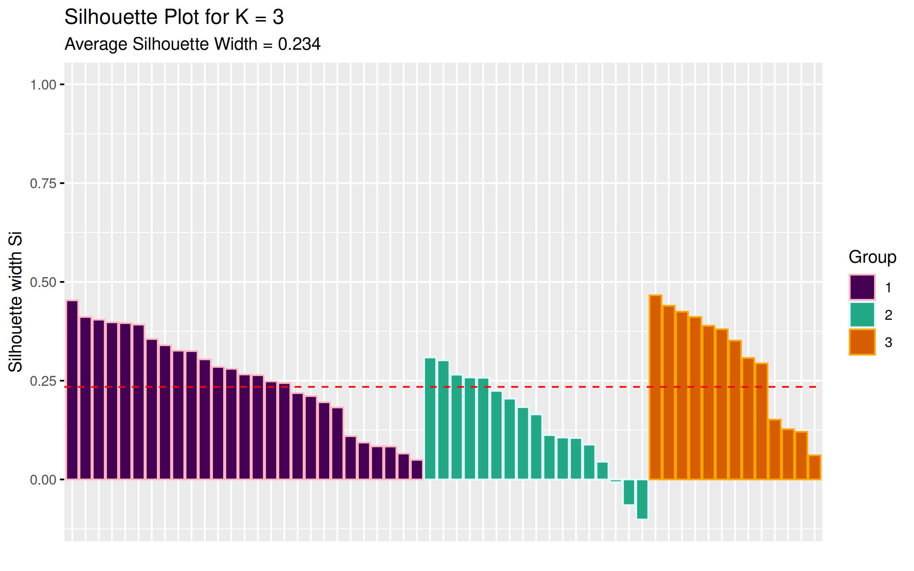
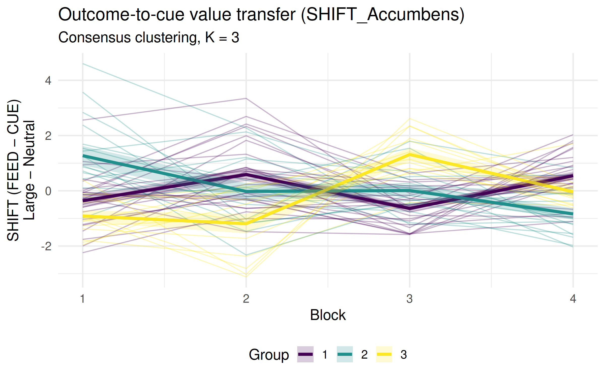
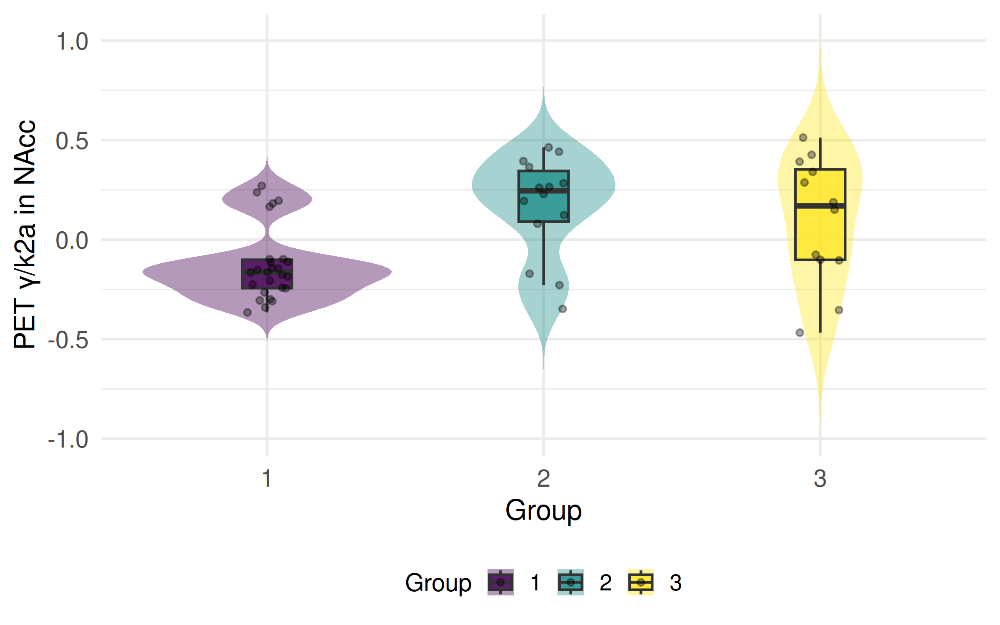
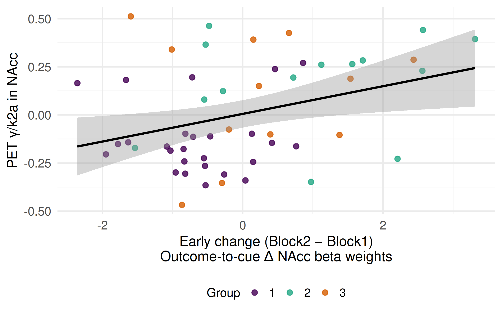
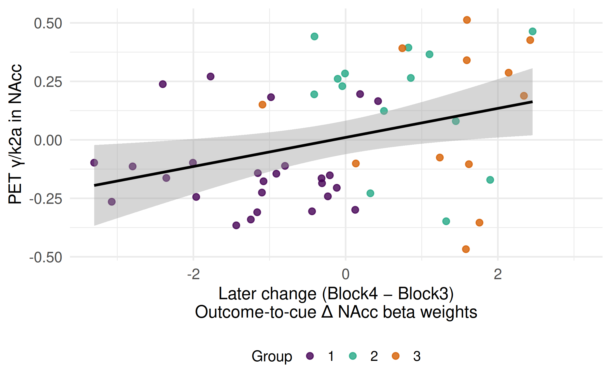

Multimodal Reward Learning in MDD patients
================

- [What this is](#what-this-is)
- [Packages](#packages)
- [1. Load data](#1-load-data)
- [2. Select ROI BOLD columns (Cue + Feedback ×
  blocks)](#2-select-roi-bold-columns-cue--feedback--blocks)
- [3. Long format & label phase, reward, block,
  ROI](#3-long-format--label-phase-reward-block-roi)
- [4. Compute reward modulation (Large/Medium/Small −
  Neutral)](#4-compute-reward-modulation-largemediumsmall--neutral)
- [5. Build SHIFT (FEED − CUE) for
  Large-Neutral](#5-build-shift-feed--cue-for-large-neutral)
- [6. Feature matrix for clustering (SHIFT_Accumbens across
  blocks)](#6-feature-matrix-for-clustering-shift_accumbens-across-blocks)
- [7. Consensus clustering](#7-consensus-clustering)
- [8. Mixed model](#8-mixed-model)
- [9. Validation metrics + silhouette
  plot](#9-validation-metrics--silhouette-plot)
- [10. Trajectories plot](#10-trajectories-plot)
- [11. Save outputs](#11-save-outputs)
- [11. PET analyses](#11-pet-analyses)
- [12. Save outputs](#12-save-outputs)

## What this is

This README is auto-generated from `analysis.Rmd` by GitHub Actions. It
loads **repo-local** data from `data/tabulated_data.csv` and runs
preprocessing + clustering.

## Packages

``` r
library(readr)
library(dplyr)
library(tidyr)
library(ggplot2)
library(viridis)
library(broom)
library(stringr)
library(purrr)
library(mclust)
library(patchwork)
library(lmerTest)
library(lme4)

# clustering + validation + plotting helpers
library(ConsensusClusterPlus)
library(cluster)       # silhouette()
library(fpc)           # cluster.stats() for Dunn
library(factoextra)    # fviz_silhouette()
```

## 1. Load data

``` r
data_path <- "data/tabulated_data.csv"

stopifnot(file.exists(data_path))

df <- readr::read_csv(data_path, show_col_types = FALSE) %>%
  mutate(ID = as.character(ID))

# quick check
dplyr::glimpse(df)
```

    ## Rows: 57
    ## Columns: 39
    ## $ ...1                                     <dbl> 1, 2, 3, 4, 5, 6, 7, 8, 9, 10…
    ## $ ID                                       <chr> "1", "2", "3", "4", "5", "6",…
    ## $ Gender                                   <chr> "male", "female", "male", "ma…
    ## $ Age                                      <dbl> 20, 20, 25, 21, 41, 20, 25, 2…
    ## $ Placebo1_Med0                            <dbl> 0, 1, 1, 1, 1, 1, 0, 1, 1, 1,…
    ## $ Accumbens_neutral_cue_block1             <dbl> 0.12972732, 0.60037232, 0.430…
    ## $ Accumbens_neutral_cue_block2             <dbl> 0.45606132, -1.94993732, 0.10…
    ## $ Accumbens_neutral_cue_block3             <dbl> -2.55305832, -0.27040532, -1.…
    ## $ Accumbens_neutral_cue_block4             <dbl> -1.78331332, 1.10315432, 0.22…
    ## $ Accumbens_small_cue_block1               <dbl> 0.97013332, -0.13071732, -0.3…
    ## $ Accumbens_small_cue_block2               <dbl> 0.69092932, -1.98736732, -0.5…
    ## $ Accumbens_small_cue_block3               <dbl> -0.86192832, 0.31881332, -0.3…
    ## $ Accumbens_small_cue_block4               <dbl> -2.3884963, 1.2862543, 0.8822…
    ## $ Accumbens_medium_cue_block1              <dbl> 0.88436832, 0.55068832, -0.46…
    ## $ Accumbens_medium_cue_block2              <dbl> 1.24813632, -1.73516632, -0.4…
    ## $ Accumbens_medium_cue_block3              <dbl> -1.38070132, -0.40730632, 0.1…
    ## $ Accumbens_medium_cue_block4              <dbl> -1.37276232, 1.61526632, 0.78…
    ## $ Accumbens_large_cue_block1               <dbl> -0.06297132, -1.47909832, 0.0…
    ## $ Accumbens_large_cue_block2               <dbl> -0.18494932, -2.65938832, -0.…
    ## $ Accumbens_large_cue_block3               <dbl> -1.39582932, 0.21508632, -1.2…
    ## $ Accumbens_large_cue_block4               <dbl> -1.18746932, 2.11181532, 1.22…
    ## $ Accumbens_neutral_FB_block1              <dbl> 2.39798032, 0.25903132, 0.724…
    ## $ Accumbens_neutral_FB_block2              <dbl> -0.43400832, -0.41715232, 1.0…
    ## $ Accumbens_neutral_FB_block3              <dbl> -0.02126332, 1.16361732, -0.1…
    ## $ Accumbens_neutral_FB_block4              <dbl> 0.11647532, 0.80733132, 0.719…
    ## $ Accumbens_small_FB_block1                <dbl> 2.57384432, 1.08259332, 1.546…
    ## $ Accumbens_small_FB_block2                <dbl> 0.95018132, -0.89703732, 0.43…
    ## $ Accumbens_small_FB_block3                <dbl> -1.0461243, 1.2120623, 0.1873…
    ## $ Accumbens_small_FB_block4                <dbl> -0.24037832, 1.01071632, 0.95…
    ## $ Accumbens_medium_FB_block1               <dbl> 1.38296332, 2.16054532, 1.121…
    ## $ Accumbens_medium_FB_block2               <dbl> 1.39321532, 0.58737432, 0.716…
    ## $ Accumbens_medium_FB_block3               <dbl> -0.21955932, -0.34362632, -0.…
    ## $ Accumbens_medium_FB_block4               <dbl> 0.10481132, 1.13842432, 1.087…
    ## $ Accumbens_large_FB_block1                <dbl> 1.6383273, 3.6799923, 0.97255…
    ## $ Accumbens_large_FB_block2                <dbl> 1.09787632, 1.49345332, 0.973…
    ## $ Accumbens_large_FB_block3                <dbl> 0.99669532, 0.90392232, -0.39…
    ## $ Accumbens_large_FB_block4                <dbl> 0.36977032, 1.04054032, 0.502…
    ## $ PET_BP_Session1_Accumbens_Winsorize      <dbl> 2.842319, 3.185009, 1.562276,…
    ## $ PET_Gamma_divided_k2a_Session1_Accumbens <dbl> 0.165488, 0.283617, 0.123568,…

## 2. Select ROI BOLD columns (Cue + Feedback × blocks)

``` r
df_roi <- df %>%
  select(
    ID, Gender, Age, Placebo1_Med0,
    matches("(Accumbens)_(small|medium|large|neutral)_(cue|FB)_block\\d+")
  ) %>%
  select(-matches("Session"))

id_vars <- c("ID", "Gender", "Age", "Placebo1_Med0")
roi_cols <- setdiff(names(df_roi), id_vars)

winsorize_iqr <- function(x) {
  q1 <- quantile(x, 0.25, na.rm = TRUE)
  q3 <- quantile(x, 0.75, na.rm = TRUE)
  iqr <- q3 - q1
  lower <- q1 - 1.5 * iqr
  upper <- q3 + 1.5 * iqr
  x[x < lower] <- lower
  x[x > upper] <- upper
  x
}

df_roi_wins <- df_roi %>%
  mutate(across(all_of(roi_cols), winsorize_iqr)) %>%
  mutate(across(all_of(roi_cols), ~ .x - mean(.x, na.rm = TRUE)))
```

## 3. Long format & label phase, reward, block, ROI

``` r
df_long <- df_roi_wins %>%
  pivot_longer(
    cols = -c(ID, Gender, Age, Placebo1_Med0),
    names_to = "tmp",
    values_to = "BOLD"
  ) %>%
  mutate(
    Reward = str_extract(tmp, "(small|medium|large|neutral)"),
    Block  = str_extract(tmp, "(?<=block)\\d+"),
    Phase  = case_when(
      str_detect(tmp, "_cue_") ~ "CUE",
      str_detect(tmp, "_FB_")  ~ "FEED",
      TRUE ~ NA_character_
    ),
    ROI = case_when(
      str_detect(tmp, "Accumbens") ~ "Accumbens",
      TRUE ~ NA_character_
    )
  ) %>%
  select(ID, Gender, Age, Placebo1_Med0, Reward, Block, ROI, Phase, BOLD)
```

## 4. Compute reward modulation (Large/Medium/Small − Neutral)

``` r
df_diff <- df_long %>%
  group_by(ID, Block, ROI, Phase, Placebo1_Med0) %>%
  summarise(
    BOLD_Large_vs_Neutral  = BOLD[Reward == "large"][1]  - BOLD[Reward == "neutral"][1],
    BOLD_Medium_vs_Neutral = BOLD[Reward == "medium"][1] - BOLD[Reward == "neutral"][1],
    BOLD_Small_vs_Neutral  = BOLD[Reward == "small"][1]  - BOLD[Reward == "neutral"][1],
    .groups = "drop"
  ) %>%
  left_join(df_long %>% distinct(ID, Age, Gender), by = "ID") %>%
  select(
    ID, Gender, Age, Placebo1_Med0, Block, ROI, Phase,
    BOLD_Large_vs_Neutral, BOLD_Medium_vs_Neutral, BOLD_Small_vs_Neutral
  )
```

## 5. Build SHIFT (FEED − CUE) for Large-Neutral

``` r
df_indv <- df_diff

df_diff_phases <- df_indv %>%
  select(ID, ROI, Block, Phase, BOLD_Large_vs_Neutral) %>%
  pivot_wider(names_from = Phase, values_from = BOLD_Large_vs_Neutral) %>%
  mutate(SHIFT = FEED - CUE)

df_diff_roi <- df_diff_phases %>%
  pivot_wider(names_from = ROI, values_from = c(CUE, FEED, SHIFT)) %>%
  mutate(subject = as.character(as.numeric(as.factor(ID)))) %>%
  left_join(df %>% mutate(subject = as.character(as.numeric(as.factor(ID)))) %>% select(subject, Age, Gender),
            by = "subject") %>%
  mutate(
    Block = as.numeric(as.character(Block)),
    subj  = factor(as.numeric(as.factor(ID)))
  )

stopifnot("SHIFT_Accumbens" %in% names(df_diff_roi))
```

## 6. Feature matrix for clustering (SHIFT_Accumbens across blocks)

``` r
features <- cbind(
  Block1 = df_diff_roi$SHIFT_Accumbens[df_diff_roi$Block == 1],
  Block2 = df_diff_roi$SHIFT_Accumbens[df_diff_roi$Block == 2],
  Block3 = df_diff_roi$SHIFT_Accumbens[df_diff_roi$Block == 3],
  Block4 = df_diff_roi$SHIFT_Accumbens[df_diff_roi$Block == 4]
)

subject_ids <- unique(df_diff_roi$ID)
features_scaled <- as.data.frame(scale(features))
rownames(features_scaled) <- subject_ids
features_scaled <- features_scaled[complete.cases(features_scaled), , drop = FALSE]
```

## 7. Consensus clustering

``` r
set.seed(234)
cons_results <- ConsensusClusterPlus(
  t(features_scaled),     # features x samples
  maxK = 6,
  reps = 200,             # keep Actions reasonably fast
  seed = 234,
  plot = "png",
  title = "figs/Consensus_Clustering",
  writeTable = FALSE
)

K_FINAL <- 3
final_clusters <- cons_results[[K_FINAL]]$consensusClass

df_with_clusters <- df_diff_roi %>%
  distinct(ID, Age, Gender) %>%
  mutate(cluster = final_clusters[match(ID, rownames(features_scaled))])

df_diff_roi_clustered <- df_diff_roi %>%
  left_join(df_with_clusters %>% select(ID, cluster), by = "ID") %>%
  mutate(
    Block = factor(Block),
    cluster = factor(cluster)
  )
```

## 8. Mixed model

``` r
fit <- lmer(SHIFT_Accumbens ~ cluster * Block + Age + Gender + (1|subject),
            data = df_diff_roi_clustered)
anova(fit)
```

    ## Type III Analysis of Variance Table with Satterthwaite's method
    ##                Sum Sq Mean Sq NumDF DenDF F value Pr(>F)    
    ## cluster         2.298  1.1488     2    52  1.3220 0.2754    
    ## Block           5.516  1.8386     3   162  2.1159 0.1003    
    ## Age             0.733  0.7326     1    52  0.8430 0.3628    
    ## Gender          0.006  0.0065     1    52  0.0075 0.9315    
    ## cluster:Block 120.113 20.0188     6   162 23.0373 <2e-16 ***
    ## ---
    ## Signif. codes:  0 '***' 0.001 '**' 0.01 '*' 0.05 '.' 0.1 ' ' 1

## 9. Validation metrics + silhouette plot

``` r
final_sil <- silhouette(as.integer(final_clusters), dist(features_scaled))
final_avg_sil <- mean(final_sil[, 3])

final_avg_sil
```

    ## [1] 0.234297

``` r
sil_plot <- factoextra::fviz_silhouette(final_sil) +
  scale_fill_viridis_d(option = "D") +
  labs(
    title = paste("Silhouette plot (K =", K_FINAL, ")"),
    subtitle = paste("Average silhouette width =", round(final_avg_sil, 3))
  )
```

    ##   cluster size ave.sil.width
    ## 1       1   27          0.26
    ## 2       2   17          0.14
    ## 3       3   13          0.30

``` r
sil_plot
```

<!-- -->

``` r
ggsave("figs/silhouette_plot_final.png", sil_plot, width = 10, height = 6)
```

## 10. Trajectories plot

``` r
df_diff_roi_clustered$Group <- df_diff_roi_clustered$cluster
# Compute cluster sizes (needed for facet labels)
cluster_sizes <- df_diff_roi_clustered %>%
  dplyr::distinct(ID, Group) %>%
  dplyr::count(Group, name = "n")

labeller_vec <- setNames(
  paste0("Group ", cluster_sizes$Group, "\n(n = ", cluster_sizes$n, ")"),
  cluster_sizes$Group
)
p_trajectories <- ggplot(
  df_diff_roi_clustered,
  aes(x = as.numeric(Block), y = SHIFT_Accumbens, group = ID, color = Group)
) +
  geom_line(alpha = 0.3, linewidth = 0.5) +
  stat_summary(aes(group = Group), fun = mean, geom = "line", linewidth = 1.4) +
  stat_summary(aes(group = Group, fill = Group), fun.data = mean_se, geom = "ribbon",
               alpha = 0.2, color = NA) +
  facet_wrap(~Group, 
               labeller = as_labeller(labeller_vec)) +
  scale_color_viridis_d(name = "Group") +
  scale_fill_viridis_d(name = "Group") +
  labs(
    title = "Outcome-to-cue value transfer (SHIFT_Accumbens)",
    subtitle = paste("Consensus clustering, K =", K_FINAL),
    x = "Block",
    y = "SHIFT (FEED − CUE)\nLarge − Neutral"
  ) +
  theme_minimal(base_size = 14) +
  theme(legend.position = "bottom")

p_trajectories
```

<!-- -->

``` r
ggsave("figs/trajectories_shift_accumbens.png", p_trajectories, width = 12, height = 5)
```

## 11. Save outputs

``` r
write.csv(df_with_clusters, "outputs/cluster_assignments_final.csv", row.names = FALSE)

df_full_clustered <- df %>%
  left_join(df_with_clusters %>% select(ID, cluster), by = "ID")

write.csv(df_full_clustered, "outputs/full_data_with_clusters_final.csv", row.names = FALSE)
```

## 11. PET analyses

``` r
# Requires this column in data/tabulated_data.csv:
stopifnot("PET_Gamma_divided_k2a_Session1_Accumbens" %in% names(df))

# Subject-level table derived from features_scaled (Block1..Block4)
df_plot <- as.data.frame(features_scaled)
df_plot$ID <- as.character(rownames(features_scaled))

df_plot <- df_plot %>%
  mutate(
    early_change = Block2 - Block1,
    later_change = Block4 - Block3,
    all_change   = Block4 - Block1
  ) %>%
  left_join(
    df %>% select(ID, PET_Gamma_divided_k2a_Session1_Accumbens, Age, Gender),
    by = "ID"
  ) %>%
  left_join(
    df_with_clusters %>% select(ID, cluster),
    by = "ID"
  ) %>%
  mutate(
    Group  = factor(cluster),
    Gender = factor(Gender)
  )

glimpse(df_plot)
```

    ## Rows: 57
    ## Columns: 13
    ## $ Block1                                   <dbl> -1.05754238, 2.58356523, -1.2…
    ## $ Block2                                   <dbl> 1.30018053, -0.73109977, -1.6…
    ## $ Block3                                   <dbl> -0.25746485, 1.66779746, -0.3…
    ## $ Block4                                   <dbl> -0.68357196, 0.84308741, -0.5…
    ## $ ID                                       <chr> "1", "10", "11", "12", "13", …
    ## $ early_change                             <dbl> 2.3577229, -3.3146650, -0.394…
    ## $ later_change                             <dbl> -0.426107116, -0.824710052, -…
    ## $ all_change                               <dbl> 0.3739704, -1.7404778, 0.7644…
    ## $ PET_Gamma_divided_k2a_Session1_Accumbens <dbl> 0.165488, 0.394323, -0.101018…
    ## $ Age                                      <dbl> 20, 24, 26, 35, 28, 28, 26, 5…
    ## $ Gender                                   <fct> male, female, female, female,…
    ## $ cluster                                  <int> 1, 2, 3, 1, 2, 2, 3, 1, 2, 1,…
    ## $ Group                                    <fct> 1, 2, 3, 1, 2, 2, 3, 1, 2, 1,…

### 11a. PET violin by Group

``` r
p_pet_violin <- ggplot(
  df_plot,
  aes(x = Group, y = PET_Gamma_divided_k2a_Session1_Accumbens, fill = Group)
) +
  geom_violin(trim = FALSE, alpha = 0.4, color = NA) +
  geom_boxplot(width = 0.18, outlier.shape = NA, alpha = 0.8) +
  geom_jitter(width = 0.08, alpha = 0.35, size = 1.4) +
  scale_fill_viridis_d(name = "Group") +
  labs(
    x = "Group",
    y = "PET γ/k2a in NAcc"
  ) +
  theme_minimal(base_size = 16) +
  theme(
    axis.title = element_text(size = 16),
    axis.text  = element_text(size = 14),
    legend.position = "bottom",
    legend.title = element_text(size = 14),
    legend.text  = element_text(size = 13)
  )

p_pet_violin
```

<!-- -->

``` r
ggsave("figs/pet_violin_by_group.png", p_pet_violin, width = 8, height = 5, dpi = 300)
```

### 11b. PET regressions with early/later change

``` r
m_early <- lm(PET_Gamma_divided_k2a_Session1_Accumbens ~ early_change + Age + Gender, data = df_plot)
m_late  <- lm(PET_Gamma_divided_k2a_Session1_Accumbens ~ later_change + Age + Gender, data = df_plot)

summary(m_early)
```

    ## 
    ## Call:
    ## lm(formula = PET_Gamma_divided_k2a_Session1_Accumbens ~ early_change + 
    ##     Age + Gender, data = df_plot)
    ## 
    ## Residuals:
    ##      Min       1Q   Median       3Q      Max 
    ## -0.48412 -0.18477 -0.02411  0.19463  0.56117 
    ## 
    ## Coefficients:
    ##                Estimate Std. Error t value Pr(>|t|)  
    ## (Intercept)  -0.0276701  0.1209537  -0.229   0.8200  
    ## early_change -0.0717999  0.0280469  -2.560   0.0137 *
    ## Age          -0.0004159  0.0039517  -0.105   0.9166  
    ## Gendermale    0.1053180  0.0724234   1.454   0.1524  
    ## ---
    ## Signif. codes:  0 '***' 0.001 '**' 0.01 '*' 0.05 '.' 0.1 ' ' 1
    ## 
    ## Residual standard error: 0.256 on 48 degrees of freedom
    ##   (5 observations deleted due to missingness)
    ## Multiple R-squared:  0.1548, Adjusted R-squared:  0.102 
    ## F-statistic:  2.93 on 3 and 48 DF,  p-value: 0.04293

``` r
summary(m_late)
```

    ## 
    ## Call:
    ## lm(formula = PET_Gamma_divided_k2a_Session1_Accumbens ~ later_change + 
    ##     Age + Gender, data = df_plot)
    ## 
    ## Residuals:
    ##      Min       1Q   Median       3Q      Max 
    ## -0.53858 -0.19110 -0.02708  0.20232  0.48829 
    ## 
    ## Coefficients:
    ##                Estimate Std. Error t value Pr(>|t|)  
    ## (Intercept)  -0.0146847  0.1226000  -0.120   0.9052  
    ## later_change -0.0568375  0.0253279  -2.244   0.0295 *
    ## Age          -0.0001578  0.0040156  -0.039   0.9688  
    ## Gendermale    0.0681842  0.0752163   0.907   0.3692  
    ## ---
    ## Signif. codes:  0 '***' 0.001 '**' 0.01 '*' 0.05 '.' 0.1 ' ' 1
    ## 
    ## Residual standard error: 0.2597 on 48 degrees of freedom
    ##   (5 observations deleted due to missingness)
    ## Multiple R-squared:  0.1306, Adjusted R-squared:  0.07626 
    ## F-statistic: 2.404 on 3 and 48 DF,  p-value: 0.07903

``` r
write.csv(broom::tidy(m_early), "outputs/lm_pet_early_change_tidy.csv", row.names = FALSE)
write.csv(broom::tidy(m_late),  "outputs/lm_pet_later_change_tidy.csv", row.names = FALSE)
```

### 11c. Scatterplots: PET vs early/later change

``` r
p_scatter_early <- ggplot(
  df_plot,
  aes(x = early_change,
      y = PET_Gamma_divided_k2a_Session1_Accumbens,
      color = Group)
) +
  geom_point(size = 2.5, alpha = 0.8) +
  geom_smooth(method = "lm", color = "black", se = TRUE, linewidth = 1.2) +
  scale_color_viridis_d(name = "Group") +
  labs(
    x = "Early change (Block2 − Block1)\nOutcome-to-cue Δ NAcc beta weights",
    y = "PET γ/k2a in NAcc"
  ) +
  theme_minimal(base_size = 16) +
  theme(
    axis.title = element_text(size = 16),
    axis.text  = element_text(size = 14),
    legend.position = "bottom",
    legend.title = element_text(size = 14),
    legend.text  = element_text(size = 13)
  )

p_scatter_early
```

<!-- -->

``` r
ggsave("figs/pet_scatter_early_change.png", p_scatter_early, width = 8, height = 6, dpi = 300)

p_scatter_late <- ggplot(
  df_plot,
  aes(x = later_change,
      y = PET_Gamma_divided_k2a_Session1_Accumbens,
      color = Group)
) +
  geom_point(size = 2.5, alpha = 0.8) +
  geom_smooth(method = "lm", color = "black", se = TRUE, linewidth = 1.2) +
  scale_color_viridis_d(name = "Group") +
  labs(
    x = "Later change (Block4 − Block3)\nOutcome-to-cue Δ NAcc beta weights",
    y = "PET γ/k2a in NAcc"
  ) +
  theme_minimal(base_size = 16) +
  theme(
    axis.title = element_text(size = 16),
    axis.text  = element_text(size = 14),
    legend.position = "bottom",
    legend.title = element_text(size = 14),
    legend.text  = element_text(size = 13)
  )

p_scatter_late
```

<!-- -->

``` r
ggsave("figs/pet_scatter_later_change.png", p_scatter_late, width = 8, height = 6, dpi = 300)
```

## 12. Save outputs

``` r
write.csv(df_with_clusters, "outputs/cluster_assignments_final.csv", row.names = FALSE)

df_full_clustered <- df %>%
  left_join(df_with_clusters %>% select(ID, cluster), by = "ID")

write.csv(df_full_clustered, "outputs/full_data_with_clusters_final.csv", row.names = FALSE)
```
