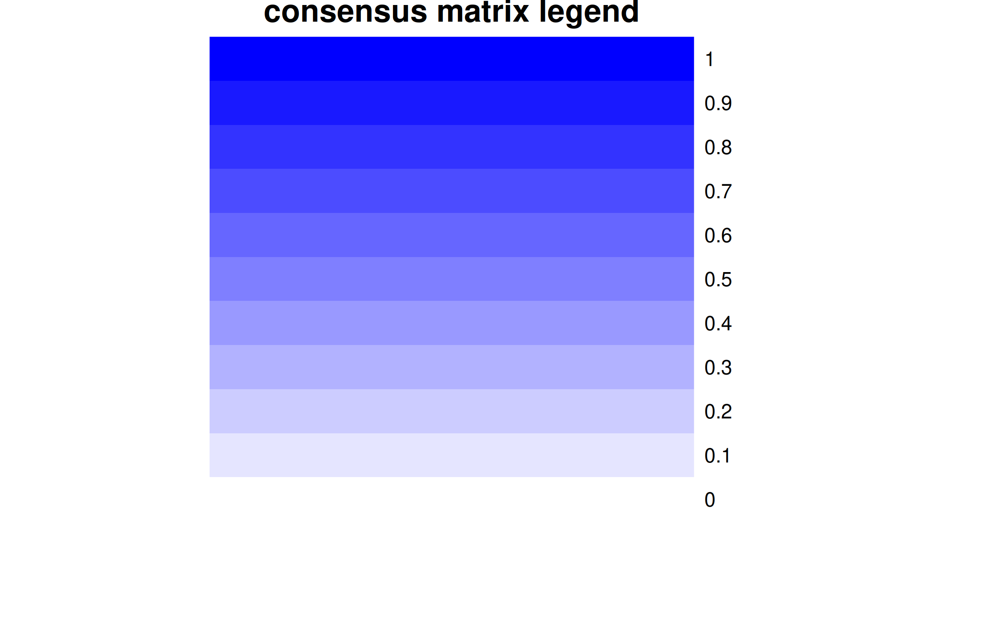
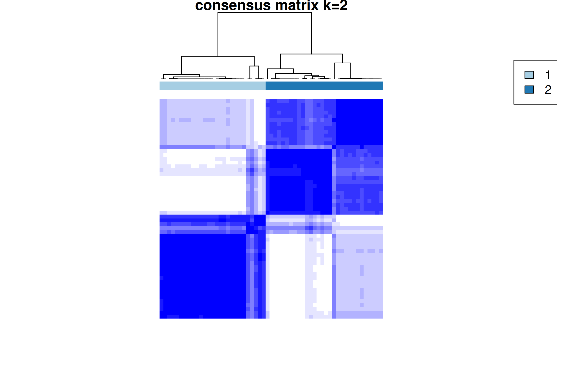
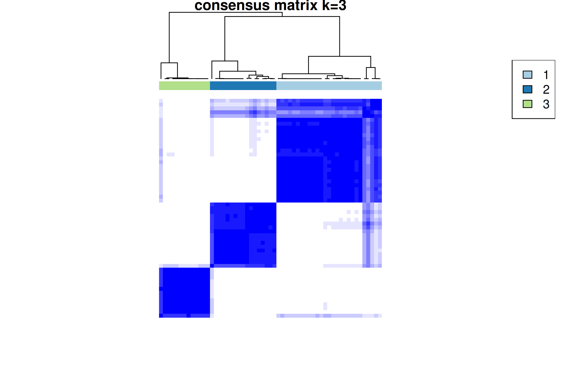
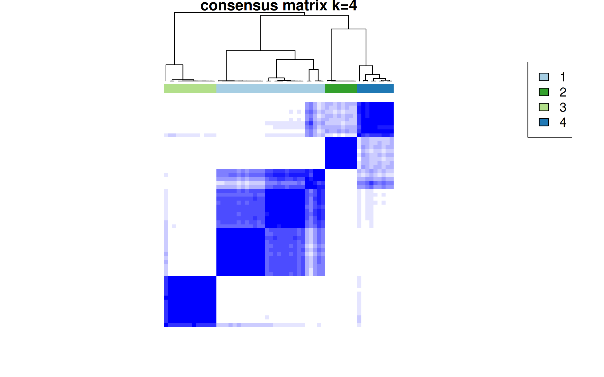
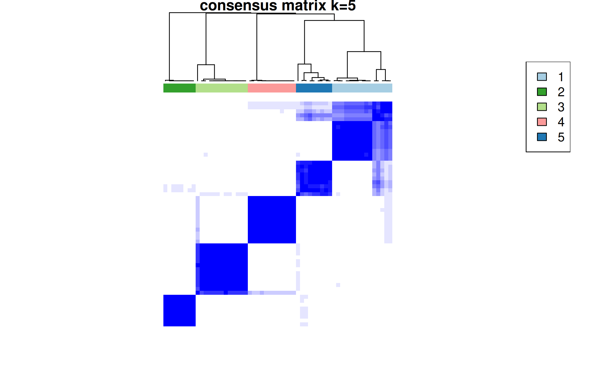
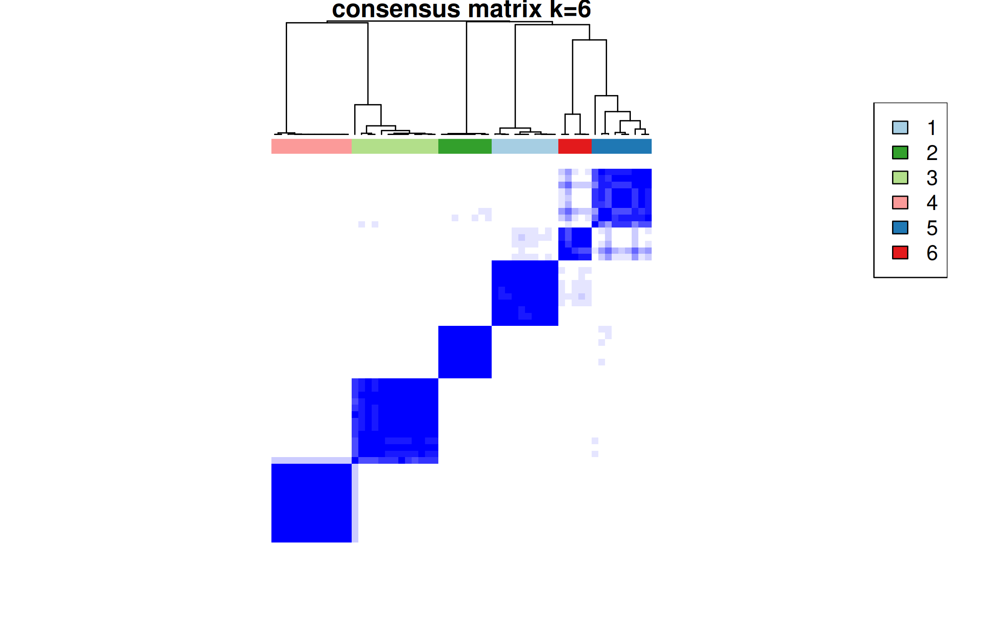
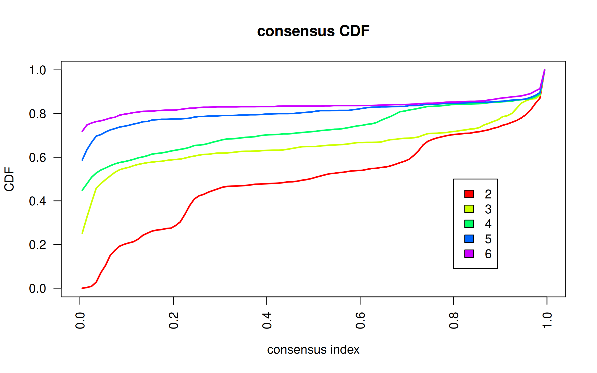
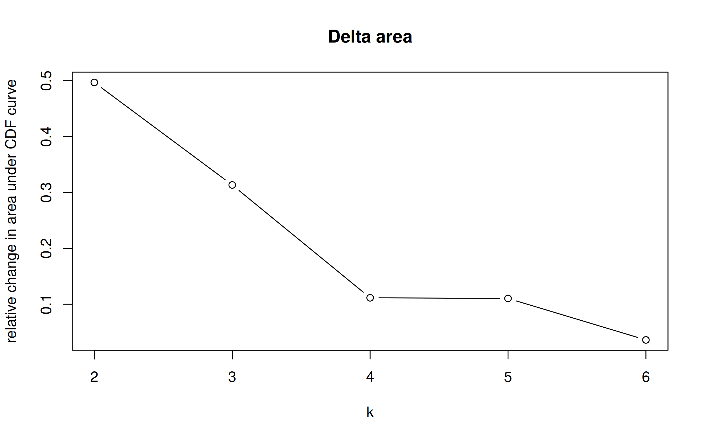
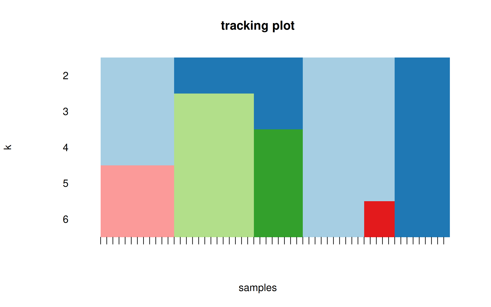

Individual differences in reward learning reveal dopaminergic
value-updating profiles linked to anhedonia and case-control differences
in major depressive disorder
================

- [Overview](#overview)
- [Requirements](#requirements)
- [Primary MDD sample](#primary-mdd-sample)
  - [1. Load data](#1-load-data)
  - [2. Preprocess NAcc beta
    estimates](#2-preprocess-nacc-beta-estimates)
  - [3. Compute reward contrasts and reward-to-cue
    shift](#3-compute-reward-contrasts-and-reward-to-cue-shift)
  - [4. Test interindividual
    heterogeneity](#4-test-interindividual-heterogeneity)
  - [5. Consensus clustering of reward-learning
    trajectories](#5-consensus-clustering-of-reward-learning-trajectories)
  - [6. Cluster-specific trajectories](#6-cluster-specific-trajectories)
  - [7. Cluster stability](#7-cluster-stability)
- [Dopaminergic associations](#dopaminergic-associations)
  - [8. PET differences across reward-learning
    profiles](#8-pet-differences-across-reward-learning-profiles)
  - [9. PET associations with reward-learning
    change](#9-pet-associations-with-reward-learning-change)
- [Clinical associations](#clinical-associations)
  - [10. Anhedonia and depressive
    symptoms](#10-anhedonia-and-depressive-symptoms)
- [Independent pharmacological MDD–HC
  sample](#independent-pharmacological-mddhc-sample)
  - [11. Load and preprocess the independent
    sample](#11-load-and-preprocess-the-independent-sample)
  - [12. Diagnosis × treatment
    analysis](#12-diagnosis--treatment-analysis)
  - [13. Apply the primary reward-learning
    classifier](#13-apply-the-primary-reward-learning-classifier)
- [Final manuscript figures](#final-manuscript-figures)
  - [14. R-based figures](#14-r-based-figures)
  - [15. Python-based main figures](#15-python-based-main-figures)
- [Reproducibility outputs](#reproducibility-outputs)
- [Session information](#session-information)

# Overview

This repository contains the reproducible analysis workflow supporting
the manuscript **“Individual differences in reward learning reveal
dopaminergic value-updating profiles linked to anhedonia and
case-control differences in major depressive disorder.”** The workflow
reconstructs the primary NAcc reward-to-cue measure, tests
interindividual heterogeneity, performs consensus clustering, evaluates
cluster stability, examines dopaminergic associations, and applies the
reward-learning phenotype to an independent pharmacological MDD–HC
sample.

The statistical analyses below use the repository-local tabulated
datasets. Final manuscript figures are reproduced from the deposited
`Source Data.xlsx` workbook using `plot_figures_from_source.R` and
`plot_figures_from_source.py`.

# Requirements

``` r
required_packages <- c(
  "readr", "readxl", "dplyr", "tidyr", "ggplot2", "stringr", "tibble",
  "lme4", "lmerTest", "emmeans", "broom", "ConsensusClusterPlus",
  "cluster", "mclust", "patchwork", "ggdendro", "ggnewscale"
)

invisible(lapply(required_packages, function(pkg) {
  if (!requireNamespace(pkg, quietly = TRUE)) {
    stop("Required package not installed: ", pkg)
  }
}))

library(readr)
library(readxl)
library(dplyr)
library(tidyr)
library(ggplot2)
library(stringr)
library(tibble)
library(lme4)
library(lmerTest)
library(emmeans)
library(broom)
library(ConsensusClusterPlus)
library(cluster)
library(mclust)
library(patchwork)
```

# Primary MDD sample

## 1. Load data

``` r
primary_file <- "data/tabulated_data.csv"
stopifnot(file.exists(primary_file))

df <- read_csv(primary_file, show_col_types = FALSE) %>%
  select(-any_of("Unnamed: 0")) %>%
  mutate(
    ID = as.character(ID)
  )

cat("Primary sample N =", n_distinct(df$ID), "\n")
```

    ## Primary sample N = 57

The primary dataset contains the bilateral nucleus accumbens (NAcc) beta
estimates used to derive the reward-to-cue shift, together with
demographic and PET variables.

## 2. Preprocess NAcc beta estimates

Condition-specific NAcc beta estimates are winsorized using a 1.5 × IQR
rule and mean-centered across participants before contrasts are
calculated.

``` r
df_roi <- df %>%
  select(
    ID, Sex, Age, 
    matches("Accumbens_(small|medium|large|neutral)_(cue|FB)_block\\d+")
  ) %>%
  select(-matches("Session"))

id_vars <- c("ID", "Sex", "Age")
roi_cols <- setdiff(names(df_roi), id_vars)

winsorize_iqr <- function(x) {
  q1 <- quantile(x, 0.25, na.rm = TRUE)
  q3 <- quantile(x, 0.75, na.rm = TRUE)
  iqr <- q3 - q1
  lower <- q1 - 1.5 * iqr
  upper <- q3 + 1.5 * iqr
  pmin(pmax(x, lower), upper)
}

df_roi_wins <- df_roi %>%
  mutate(across(all_of(roi_cols), winsorize_iqr)) %>%
  mutate(across(all_of(roi_cols), ~ .x - mean(.x, na.rm = TRUE)))
```

## 3. Compute reward contrasts and reward-to-cue shift

For each learning block, reward-related activity is defined as reward
minus neutral separately during cue and outcome processing. The primary
measure is the **Large Reward \> Neutral reward-to-cue shift**,
calculated as cue-related minus outcome-related NAcc activity. Positive
values therefore indicate relatively greater cue-related representation,
whereas negative values indicate relatively greater reward-outcome
representation.

``` r
df_long <- df_roi_wins %>%
  pivot_longer(
    cols = all_of(roi_cols),
    names_to = "variable",
    values_to = "BOLD"
  ) %>%
  mutate(
    Reward = str_extract(variable, "(small|medium|large|neutral)"),
    Block = as.integer(str_extract(variable, "(?<=block)\\d+")),
    Phase = case_when(
      str_detect(variable, "_cue_") ~ "CUE",
      str_detect(variable, "_FB_")  ~ "OUTCOME",
      TRUE ~ NA_character_
    )
  ) %>%
  select(ID, Sex, Age, Reward, Block, Phase, BOLD)

df_diff <- df_long %>%
  group_by(ID, Sex, Age, Block, Phase) %>%
  summarise(
    large_vs_neutral  = BOLD[Reward == "large"][1]  - BOLD[Reward == "neutral"][1],
    medium_vs_neutral = BOLD[Reward == "medium"][1] - BOLD[Reward == "neutral"][1],
    small_vs_neutral  = BOLD[Reward == "small"][1]  - BOLD[Reward == "neutral"][1],
    .groups = "drop"
  )

df_diff_phases <- df_diff %>%
  pivot_wider(
    names_from = Phase,
    values_from = c(large_vs_neutral, medium_vs_neutral, small_vs_neutral)
  ) %>%
  mutate(
    shift = large_vs_neutral_CUE - large_vs_neutral_OUTCOME,
    medium_shift = medium_vs_neutral_CUE - medium_vs_neutral_OUTCOME,
    small_shift = small_vs_neutral_CUE - small_vs_neutral_OUTCOME,
    subject = factor(ID)
  )

stopifnot(nrow(df_diff_phases) == 4 * n_distinct(df_diff_phases$ID))
```

## 4. Test interindividual heterogeneity

Before clustering, a random-intercept model is compared with a model
allowing participant-specific slopes across learning blocks. Models are
estimated by maximum likelihood for the likelihood-ratio comparison.

``` r
m_random_intercept <- lmer(
  shift ~ Block + Age + Sex + (1 | ID),
  data = df_diff_phases,
  REML = FALSE
)

m_random_slope <- lmer(
  shift ~ Block + Age + Sex + (Block | ID),
  data = df_diff_phases,
  REML = FALSE
)

anova(m_random_intercept, m_random_slope)
```

    ## Data: df_diff_phases
    ## Models:
    ## m_random_intercept: shift ~ Block + Age + Sex + (1 | ID)
    ## m_random_slope: shift ~ Block + Age + Sex + (Block | ID)
    ##                    npar    AIC    BIC  logLik -2*log(L)  Chisq Df Pr(>Chisq)  
    ## m_random_intercept    6 747.19 767.77 -367.60    735.19                       
    ## m_random_slope        8 744.71 772.14 -364.36    728.71 6.4821  2    0.03912 *
    ## ---
    ## Signif. codes:  0 '***' 0.001 '**' 0.01 '*' 0.05 '.' 0.1 ' ' 1

``` r
VarCorr(m_random_slope)
```

    ##  Groups   Name        Std.Dev. Corr   
    ##  ID       (Intercept) 1.11562         
    ##           Block       0.33259  -1.000 
    ##  Residual             1.11947

``` r
random_effects <- ranef(m_random_slope)$ID %>%
  rownames_to_column("ID") %>%
  rename(
    random_intercept = `(Intercept)`,
    random_slope = Block
  )

fixed_effects <- fixef(m_random_slope)

subject_slopes <- random_effects %>%
  transmute(
    ID,
    subject_intercept = unname(fixed_effects["(Intercept)"]) + random_intercept,
    subject_slope = unname(fixed_effects["Block"]) + random_slope
  )

write_csv(subject_slopes, "outputs/subject_specific_slopes.csv")
```

## 5. Consensus clustering of reward-learning trajectories

Clustering uses each participant’s four-block Large Reward \> Neutral
reward-to-cue trajectory. Features are standardized across participants.
ConsensusClusterPlus is run with hierarchical clustering, average
linkage, Pearson distance, 500 resamples, and a fixed random seed. The
final solution uses **K = 3**.

``` r
features_df <- df_diff_phases %>%
  select(ID, Block, shift) %>%
  pivot_wider(names_from = Block, values_from = shift, names_prefix = "Block") %>%
  arrange(ID) %>%
  filter(if_all(starts_with("Block"), ~ !is.na(.x)))

subject_ids <- features_df$ID
features <- features_df %>%
  select(Block1, Block2, Block3, Block4) %>%
  as.data.frame()
rownames(features) <- subject_ids

features_scaled <- as.data.frame(scale(features))

set.seed(234)
cons_results <- ConsensusClusterPlus(
  t(as.matrix(features_scaled)),
  maxK = 6,
  reps = 500,
  seed = 234,
  clusterAlg = "hc",
  innerLinkage = "average",
  finalLinkage = "average",
  distance = "pearson",
  plot = NULL,
  writeTable = FALSE
)
```

<!-- --><!-- --><!-- --><!-- --><!-- --><!-- --><!-- --><!-- --><!-- -->

``` r
K_FINAL <- 3
final_clusters <- cons_results[[K_FINAL]]$consensusClass
names(final_clusters) <- rownames(features_scaled)

table(final_clusters)
```

    ## final_clusters
    ##  1  2  3 
    ## 27 17 13

``` r
cluster_assignments <- tibble(
  ID = names(final_clusters),
  cluster = factor(as.integer(final_clusters), levels = 1:3)
)

write_csv(cluster_assignments, "outputs/cluster_assignments_final.csv")
```

## 6. Cluster-specific trajectories

``` r
df_clustered <- df_diff_phases %>%
  inner_join(cluster_assignments, by = "ID") %>%
  mutate(
    Block_f = factor(Block),
    cluster = factor(cluster, levels = 1:3)
  )

model_cluster <- lmer(
  shift ~ cluster * Block_f + Age + Sex + (1 | ID),
  data = df_clustered
)

anova(model_cluster)
```

    ## Type III Analysis of Variance Table with Satterthwaite's method
    ##                  Sum Sq Mean Sq NumDF DenDF F value Pr(>F)    
    ## cluster           2.298  1.1488     2    52  1.3220 0.2754    
    ## Block_f           5.516  1.8386     3   162  2.1159 0.1003    
    ## Age               0.733  0.7326     1    52  0.8430 0.3628    
    ## Sex               0.006  0.0065     1    52  0.0075 0.9315    
    ## cluster:Block_f 120.113 20.0188     6   162 23.0373 <2e-16 ***
    ## ---
    ## Signif. codes:  0 '***' 0.001 '**' 0.01 '*' 0.05 '.' 0.1 ' ' 1

``` r
summary(model_cluster)
```

    ## Linear mixed model fit by REML. t-tests use Satterthwaite's method [
    ## lmerModLmerTest]
    ## Formula: shift ~ cluster * Block_f + Age + Sex + (1 | ID)
    ##    Data: df_clustered
    ## 
    ## REML criterion at convergence: 649.5
    ## 
    ## Scaled residuals: 
    ##      Min       1Q   Median       3Q      Max 
    ## -3.12921 -0.46045  0.03058  0.59510  2.37627 
    ## 
    ## Random effects:
    ##  Groups   Name        Variance Std.Dev.
    ##  ID       (Intercept) 0.1247   0.3531  
    ##  Residual             0.8690   0.9322  
    ## Number of obs: 228, groups:  ID, 57
    ## 
    ## Fixed effects:
    ##                     Estimate Std. Error         df t value Pr(>|t|)    
    ## (Intercept)         0.148612   0.313320  88.420706   0.474 0.636446    
    ## cluster2           -1.637615   0.310679 200.850266  -5.271 3.49e-07 ***
    ## cluster3            0.575641   0.337812 201.642832   1.704 0.089916 .  
    ## Block_f2           -0.950702   0.253710 162.000000  -3.747 0.000248 ***
    ## Block_f3            0.277936   0.253710 162.000000   1.095 0.274929    
    ## Block_f4           -0.907056   0.253710 162.000000  -3.575 0.000462 ***
    ## Age                 0.007758   0.008449  52.000000   0.918 0.362773    
    ## Sexmale            -0.013696   0.158491  52.000000  -0.086 0.931468    
    ## cluster2:Block_f2   2.246339   0.408168 162.000000   5.503 1.43e-07 ***
    ## cluster3:Block_f2   1.230944   0.445036 162.000000   2.766 0.006335 ** 
    ## cluster2:Block_f3   0.983297   0.408168 162.000000   2.409 0.017116 *  
    ## cluster3:Block_f3  -2.504491   0.445036 162.000000  -5.628 7.87e-08 ***
    ## cluster2:Block_f4   3.017068   0.408168 162.000000   7.392 7.32e-12 ***
    ## cluster3:Block_f4   0.031695   0.445036 162.000000   0.071 0.943310    
    ## ---
    ## Signif. codes:  0 '***' 0.001 '**' 0.01 '*' 0.05 '.' 0.1 ' ' 1

``` r
emm_cluster_block <- emmeans(model_cluster, ~ cluster | Block_f)
pairs(emm_cluster_block, adjust = "none")
```

    ## Block_f = 1:
    ##  contrast            estimate    SE  df t.ratio p.value
    ##  cluster1 - cluster2    1.638 0.311 201   5.271 <0.0001
    ##  cluster1 - cluster3   -0.576 0.338 202  -1.704  0.0899
    ##  cluster2 - cluster3   -2.213 0.369 201  -5.991 <0.0001
    ## 
    ## Block_f = 2:
    ##  contrast            estimate    SE  df t.ratio p.value
    ##  cluster1 - cluster2   -0.609 0.311 201  -1.959  0.0515
    ##  cluster1 - cluster3   -1.807 0.338 202  -5.348 <0.0001
    ##  cluster2 - cluster3   -1.198 0.369 201  -3.242  0.0014
    ## 
    ## Block_f = 3:
    ##  contrast            estimate    SE  df t.ratio p.value
    ##  cluster1 - cluster2    0.654 0.311 201   2.106  0.0364
    ##  cluster1 - cluster3    1.929 0.338 202   5.710 <0.0001
    ##  cluster2 - cluster3    1.275 0.369 201   3.450  0.0007
    ## 
    ## Block_f = 4:
    ##  contrast            estimate    SE  df t.ratio p.value
    ##  cluster1 - cluster2   -1.379 0.311 201  -4.440 <0.0001
    ##  cluster1 - cluster3   -0.607 0.338 202  -1.798  0.0737
    ##  cluster2 - cluster3    0.772 0.369 201   2.090  0.0379
    ## 
    ## Results are averaged over the levels of: Sex 
    ## Degrees-of-freedom method: kenward-roger

## 7. Cluster stability

Silhouette width is calculated using Pearson-distance geometry,
consistent with the clustering distance. Cluster stability is
additionally evaluated by rerunning consensus clustering in bootstrap
samples and comparing assignments with the original K = 3 solution using
the Adjusted Rand Index (ARI).

``` r
pearson_dist <- as.dist(1 - cor(t(as.matrix(features_scaled)), method = "pearson"))
final_sil <- silhouette(as.integer(final_clusters), pearson_dist)

cat("Mean silhouette width:", mean(final_sil[, "sil_width"]), "\n")
```

    ## Mean silhouette width: 0.5158507

``` r
silhouette_source <- tibble(
  ID = rownames(features_scaled),
  cluster = as.integer(final_clusters),
  silhouette_width = final_sil[, "sil_width"]
)
write_csv(silhouette_source, "outputs/silhouette_values.csv")
```

The full 500 × 500 nested bootstrap procedure used for the manuscript is
computationally intensive. The code below is disabled during routine
README rendering but can be enabled for full reproduction.

``` r
X <- as.data.frame(t(features_scaled))
orig_class <- final_clusters
B <- 500
ari <- numeric(B)

set.seed(234)
for (b in seq_len(B)) {
  boot_cols <- sample(colnames(X), replace = TRUE)
  Xb <- X[, boot_cols, drop = FALSE]

  res_b <- ConsensusClusterPlus(
    as.matrix(Xb),
    maxK = 3,
    reps = 500,
    seed = b,
    clusterAlg = "hc",
    innerLinkage = "average",
    finalLinkage = "average",
    distance = "pearson",
    plot = NULL,
    writeTable = FALSE
  )

  boot_class <- res_b[[3]]$consensusClass
  names(boot_class) <- colnames(Xb)
  ari[b] <- adjustedRandIndex(orig_class[boot_cols], boot_class)
}

summary(ari)
quantile(ari, c(.025, .50, .975))
write_csv(tibble(iteration = seq_len(B), ARI = ari), "outputs/bootstrap_ARI.csv")
```

# Dopaminergic associations

## 8. PET differences across reward-learning profiles

The primary PET measure is NAcc `gamma/k2a` from the lp-ntPET model.
Cluster differences are tested using ANCOVA with age and sex as
covariates.

``` r
df_subject <- df %>%
  inner_join(cluster_assignments, by = "ID") %>%
  mutate(cluster = factor(cluster, levels = 1:3))

pet_model <- lm(
  PET_Gamma_divided_k2a_Session1_Accumbens ~ cluster + Age + Sex,
  data = df_subject
)

anova(pet_model)
```

    ## Analysis of Variance Table
    ## 
    ## Response: PET_Gamma_divided_k2a_Session1_Accumbens
    ##           Df  Sum Sq Mean Sq F value   Pr(>F)   
    ## cluster    2 0.93201 0.46601  7.9831 0.001036 **
    ## Age        1 0.00106 0.00106  0.0182 0.893249   
    ## Sex        1 0.04563 0.04563  0.7818 0.381104   
    ## Residuals 47 2.74359 0.05837                    
    ## ---
    ## Signif. codes:  0 '***' 0.001 '**' 0.01 '*' 0.05 '.' 0.1 ' ' 1

``` r
summary(pet_model)
```

    ## 
    ## Call:
    ## lm(formula = PET_Gamma_divided_k2a_Session1_Accumbens ~ cluster + 
    ##     Age + Sex, data = df_subject)
    ## 
    ## Residuals:
    ##      Min       1Q   Median       3Q      Max 
    ## -0.54259 -0.15588 -0.00191  0.16498  0.38524 
    ## 
    ## Coefficients:
    ##               Estimate Std. Error t value Pr(>|t|)   
    ## (Intercept) -1.454e-01  1.204e-01  -1.208  0.23312   
    ## cluster2     2.811e-01  8.159e-02   3.445  0.00121 **
    ## cluster3     2.218e-01  8.493e-02   2.612  0.01205 * 
    ## Age         -9.768e-05  3.748e-03  -0.026  0.97932   
    ## Sexmale      6.154e-02  6.961e-02   0.884  0.38110   
    ## ---
    ## Signif. codes:  0 '***' 0.001 '**' 0.01 '*' 0.05 '.' 0.1 ' ' 1
    ## 
    ## Residual standard error: 0.2416 on 47 degrees of freedom
    ##   (5 observations deleted due to missingness)
    ## Multiple R-squared:  0.2629, Adjusted R-squared:  0.2002 
    ## F-statistic: 4.192 on 4 and 47 DF,  p-value: 0.005527

``` r
pet_emm <- emmeans(pet_model, ~ cluster)
pairs(pet_emm, adjust = "fdr")
```

    ##  contrast            estimate     SE df t.ratio p.value
    ##  cluster1 - cluster2  -0.2811 0.0816 47  -3.445  0.0036
    ##  cluster1 - cluster3  -0.2218 0.0849 47  -2.612  0.0181
    ##  cluster2 - cluster3   0.0593 0.0960 47   0.617  0.5401
    ## 
    ## Results are averaged over the levels of: Sex 
    ## P value adjustment: fdr method for 3 tests

## 9. PET associations with reward-learning change

Early change is defined as Block 2 − Block 1, later change as Block 4 −
Block 3, and overall change as Block 4 − Block 1. Associations with PET
`gamma/k2a` are adjusted for age and sex.

``` r
trajectory_subject <- features_df %>%
  mutate(
    early_change = Block2 - Block1,
    later_change = Block4 - Block3,
    overall_change = Block4 - Block1
  ) %>%
  left_join(
    df %>% select(ID, Age, Sex, PET_Gamma_divided_k2a_Session1_Accumbens),
    by = "ID"
  )

m_pet_early <- lm(
  PET_Gamma_divided_k2a_Session1_Accumbens ~ early_change + Age + Sex,
  data = trajectory_subject
)
m_pet_later <- lm(
  PET_Gamma_divided_k2a_Session1_Accumbens ~ later_change + Age + Sex,
  data = trajectory_subject
)
m_pet_overall <- lm(
  PET_Gamma_divided_k2a_Session1_Accumbens ~ overall_change + Age + Sex,
  data = trajectory_subject
)

bind_rows(
  tidy(m_pet_early) %>% mutate(model = "early_change"),
  tidy(m_pet_later) %>% mutate(model = "later_change"),
  tidy(m_pet_overall) %>% mutate(model = "overall_change")
) %>%
  write_csv("outputs/pet_change_models.csv")

summary(m_pet_early)
```

    ## 
    ## Call:
    ## lm(formula = PET_Gamma_divided_k2a_Session1_Accumbens ~ early_change + 
    ##     Age + Sex, data = trajectory_subject)
    ## 
    ## Residuals:
    ##     Min      1Q  Median      3Q     Max 
    ## -0.4839 -0.1848 -0.0239  0.1962  0.5605 
    ## 
    ## Coefficients:
    ##                Estimate Std. Error t value Pr(>|t|)  
    ## (Intercept)  -0.0274302  0.1209558  -0.227   0.8216  
    ## early_change  0.0515003  0.0201248   2.559   0.0137 *
    ## Age          -0.0004253  0.0039517  -0.108   0.9147  
    ## Sexmale       0.1052692  0.0724266   1.453   0.1526  
    ## ---
    ## Signif. codes:  0 '***' 0.001 '**' 0.01 '*' 0.05 '.' 0.1 ' ' 1
    ## 
    ## Residual standard error: 0.256 on 48 degrees of freedom
    ##   (5 observations deleted due to missingness)
    ## Multiple R-squared:  0.1547, Adjusted R-squared:  0.1019 
    ## F-statistic: 2.929 on 3 and 48 DF,  p-value: 0.04301

``` r
summary(m_pet_later)
```

    ## 
    ## Call:
    ## lm(formula = PET_Gamma_divided_k2a_Session1_Accumbens ~ later_change + 
    ##     Age + Sex, data = trajectory_subject)
    ## 
    ## Residuals:
    ##      Min       1Q   Median       3Q      Max 
    ## -0.54036 -0.19014 -0.02842  0.19900  0.48871 
    ## 
    ## Coefficients:
    ##                Estimate Std. Error t value Pr(>|t|)  
    ## (Intercept)  -0.0160572  0.1224032  -0.131    0.896  
    ## later_change  0.0559491  0.0245264   2.281    0.027 *
    ## Age          -0.0001081  0.0040106  -0.027    0.979  
    ## Sexmale       0.0684325  0.0750235   0.912    0.366  
    ## ---
    ## Signif. codes:  0 '***' 0.001 '**' 0.01 '*' 0.05 '.' 0.1 ' ' 1
    ## 
    ## Residual standard error: 0.2592 on 48 degrees of freedom
    ##   (5 observations deleted due to missingness)
    ## Multiple R-squared:  0.1333, Adjusted R-squared:  0.07918 
    ## F-statistic: 2.462 on 3 and 48 DF,  p-value: 0.07385

``` r
summary(m_pet_overall)
```

    ## 
    ## Call:
    ## lm(formula = PET_Gamma_divided_k2a_Session1_Accumbens ~ overall_change + 
    ##     Age + Sex, data = trajectory_subject)
    ## 
    ## Residuals:
    ##      Min       1Q   Median       3Q      Max 
    ## -0.52378 -0.16843 -0.01859  0.23709  0.51149 
    ## 
    ## Coefficients:
    ##                 Estimate Std. Error t value Pr(>|t|)  
    ## (Intercept)    -0.020883   0.124271  -0.168   0.8673  
    ## overall_change  0.040870   0.021446   1.906   0.0627 .
    ## Age            -0.000304   0.004068  -0.075   0.9407  
    ## Sexmale         0.089047   0.074886   1.189   0.2402  
    ## ---
    ## Signif. codes:  0 '***' 0.001 '**' 0.01 '*' 0.05 '.' 0.1 ' ' 1
    ## 
    ## Residual standard error: 0.2632 on 48 degrees of freedom
    ##   (5 observations deleted due to missingness)
    ## Multiple R-squared:  0.107,  Adjusted R-squared:  0.05115 
    ## F-statistic: 1.916 on 3 and 48 DF,  p-value: 0.1395

# Clinical associations

## 10. Anhedonia and depressive symptoms

Clinical variables used in the manuscript are reproduced in the
deposited Source Data workbook and final figure script. They are not
duplicated in `data/tabulated_data.csv`; therefore, the
figure-reproduction workflow below is the authoritative repository path
for the SHAPS and related manuscript panels.

# Independent pharmacological MDD–HC sample

## 11. Load and preprocess the independent sample

``` r
secondary_file <- "data/tabulated_data_secondary.csv"
stopifnot(file.exists(secondary_file))

df_secondary <- read_csv(secondary_file, show_col_types = FALSE) %>%
  select(-any_of("Unnamed: 0")) %>%
  mutate(
    ID = as.character(ID)
  )

secondary_roi_cols <- c(
  "CUE_Accumbens_Reward", "CUE_Accumbens_Neutral",
  "FEED_Accumbens_Reward", "FEED_Accumbens_Neutral"
)

df_secondary <- df_secondary %>%
  group_by(diagnosis, treatment) %>%
  mutate(across(all_of(secondary_roi_cols), winsorize_iqr)) %>%
  ungroup() %>%
  mutate(
    cue_contrast = CUE_Accumbens_Reward - CUE_Accumbens_Neutral,
    outcome_contrast = FEED_Accumbens_Reward - FEED_Accumbens_Neutral,
    shift = cue_contrast - outcome_contrast
  )

cat("Independent sample N =", n_distinct(df_secondary$ID), "\n")
```

    ## Independent sample N = 89

## 12. Diagnosis × treatment analysis

``` r
secondary_model <- lm(
  shift ~ diagnosis * treatment + age + sex,
  data = df_secondary
)

anova(secondary_model)
```

    ## Analysis of Variance Table
    ## 
    ## Response: shift
    ##                     Df  Sum Sq Mean Sq F value  Pr(>F)  
    ## diagnosis            1   1.699  1.6990  1.3535 0.24800  
    ## treatment            1   0.696  0.6964  0.5548 0.45848  
    ## age                  1   0.004  0.0045  0.0036 0.95252  
    ## sex                  1   0.263  0.2631  0.2096 0.64828  
    ## diagnosis:treatment  1   6.495  6.4946  5.1737 0.02551 *
    ## Residuals           83 104.190  1.2553                  
    ## ---
    ## Signif. codes:  0 '***' 0.001 '**' 0.01 '*' 0.05 '.' 0.1 ' ' 1

``` r
summary(secondary_model)
```

    ## 
    ## Call:
    ## lm(formula = shift ~ diagnosis * treatment + age + sex, data = df_secondary)
    ## 
    ## Residuals:
    ##      Min       1Q   Median       3Q      Max 
    ## -2.95532 -0.66042  0.08316  0.51055  3.02374 
    ## 
    ## Coefficients:
    ##                           Estimate Std. Error t value Pr(>|t|)  
    ## (Intercept)             -0.0316780  0.5381229  -0.059   0.9532  
    ## diagnosisMDD             0.2533103  0.3340253   0.758   0.4504  
    ## treatmentp               0.3942258  0.3435394   1.148   0.2545  
    ## age                     -0.0005387  0.0186846  -0.029   0.9771  
    ## sex                     -0.0565152  0.3028535  -0.187   0.8524  
    ## diagnosisMDD:treatmentp -1.0901255  0.4792637  -2.275   0.0255 *
    ## ---
    ## Signif. codes:  0 '***' 0.001 '**' 0.01 '*' 0.05 '.' 0.1 ' ' 1
    ## 
    ## Residual standard error: 1.12 on 83 degrees of freedom
    ## Multiple R-squared:  0.08079,    Adjusted R-squared:  0.02542 
    ## F-statistic: 1.459 on 5 and 83 DF,  p-value: 0.2121

``` r
secondary_emm <- emmeans(secondary_model, ~ diagnosis * treatment)
pairs(secondary_emm, adjust = "none")
```

    ##  contrast      estimate    SE df t.ratio p.value
    ##  HC a - MDD a    -0.253 0.334 83  -0.758  0.4504
    ##  HC a - HC p     -0.394 0.344 83  -1.148  0.2545
    ##  HC a - MDD p     0.443 0.331 83   1.335  0.1855
    ##  MDD a - HC p    -0.141 0.350 83  -0.402  0.6884
    ##  MDD a - MDD p    0.696 0.339 83   2.054  0.0431
    ##  HC p - MDD p     0.837 0.343 83   2.438  0.0169
    ## 
    ## Results are averaged over the levels of: sex

## 13. Apply the primary reward-learning classifier

Block 4 was the strongest single-block predictor of primary-sample
cluster membership. The multinomial classifier used for the manuscript
is fit to the primary sample and applied to the independent sample’s
reward-to-cue shift.

``` r
# This section requires caret and nnet and is disabled during routine knitting.
library(caret)
library(nnet)

classifier_data <- features_scaled %>%
  rownames_to_column("ID") %>%
  inner_join(cluster_assignments, by = "ID") %>%
  mutate(
    cluster = factor(cluster, levels = 1:3, labels = c("C1", "C2", "C3"))
  )

ctrl <- trainControl(
  method = "repeatedcv",
  number = 10,
  repeats = 5,
  classProbs = TRUE,
  summaryFunction = multiClassSummary,
  savePredictions = "final"
)

predictors <- c("Block1", "Block2", "Block3", "Block4")
cv_models <- lapply(predictors, function(p) {
  train(
    reformulate(p, response = "cluster"),
    data = classifier_data,
    method = "multinom",
    trControl = ctrl,
    trace = FALSE
  )
})
names(cv_models) <- predictors
```

# Final manuscript figures

The final manuscript figures are generated from `Source Data.xlsx`,
which contains the values deposited with the manuscript. The R script
reproduces Fig. 2 and the R-based supplementary figures; the Python
script reproduces main Figs. 3–5 and the Python-based supplementary
figures. Keeping these scripts separate from the inferential workflow
above ensures that the displayed figures are generated directly from the
deposited source data.

## 14. R-based figures

``` r
source("plot_figures_from_source.R", local = new.env(parent = globalenv()))
```

The R source-data script also reproduces the clustering diagnostics and
sensitivity/control figures, including Supplementary Figs. 5–10, 13, and
16–18.

## 15. Python-based main figures

``` r
python_ok <- nzchar(Sys.which("python3"))
if (python_ok) {
  system2("python3", "plot_figures_from_source.py")
}
```

# Reproducibility outputs

``` r
write_csv(
  df_clustered %>%
    select(ID, Sex, Age, Block, shift, cluster),
  "outputs/primary_reward_to_cue_with_clusters.csv"
)

write_csv(
  df %>% inner_join(cluster_assignments, by = "ID"),
  "outputs/full_data_with_clusters_final.csv"
)

write_csv(
  df_secondary %>%
    select(ID, diagnosis, treatment, sex, age, cue_contrast, outcome_contrast, shift),
  "outputs/secondary_reward_to_cue.csv"
)
```

# Session information

``` r
sessionInfo()
```

    ## R version 4.6.1 (2026-06-24)
    ## Platform: x86_64-pc-linux-gnu
    ## Running under: Ubuntu 24.04.5 LTS
    ## 
    ## Matrix products: default
    ## BLAS:   /usr/lib/x86_64-linux-gnu/openblas-pthread/libblas.so.3 
    ## LAPACK: /usr/lib/x86_64-linux-gnu/openblas-pthread/libopenblasp-r0.3.26.so;  LAPACK version 3.12.0
    ## 
    ## locale:
    ##  [1] LC_CTYPE=C.UTF-8       LC_NUMERIC=C           LC_TIME=C.UTF-8       
    ##  [4] LC_COLLATE=C.UTF-8     LC_MONETARY=C.UTF-8    LC_MESSAGES=C.UTF-8   
    ##  [7] LC_PAPER=C.UTF-8       LC_NAME=C              LC_ADDRESS=C          
    ## [10] LC_TELEPHONE=C         LC_MEASUREMENT=C.UTF-8 LC_IDENTIFICATION=C   
    ## 
    ## time zone: UTC
    ## tzcode source: system (glibc)
    ## 
    ## attached base packages:
    ## [1] stats     graphics  grDevices utils     datasets  methods   base     
    ## 
    ## other attached packages:
    ##  [1] patchwork_1.3.2             mclust_6.1.3               
    ##  [3] cluster_2.1.8.2             ConsensusClusterPlus_1.76.0
    ##  [5] broom_1.0.13                emmeans_2.0.4              
    ##  [7] lmerTest_3.2-1              lme4_2.0-6                 
    ##  [9] Matrix_1.7-5                tibble_3.3.1               
    ## [11] stringr_1.6.0               ggplot2_4.0.3              
    ## [13] tidyr_1.3.2                 dplyr_1.2.1                
    ## [15] readxl_1.5.0.1              readr_2.2.0                
    ## 
    ## loaded via a namespace (and not attached):
    ##  [1] gtable_0.3.6        xfun_0.61           Biobase_2.72.0     
    ##  [4] lattice_0.22-9      tzdb_0.5.0          numDeriv_2016.8-1.1
    ##  [7] vctrs_0.7.3         tools_4.6.1         Rdpack_2.6.6       
    ## [10] generics_0.1.4      pbkrtest_0.5.5      parallel_4.6.1     
    ## [13] pkgconfig_2.0.3     ggnewscale_0.5.2    RColorBrewer_1.1-3 
    ## [16] S7_0.2.2            lifecycle_1.0.5     compiler_4.6.1     
    ## [19] farver_2.1.2        htmltools_0.5.9     yaml_2.3.12        
    ## [22] crayon_1.5.3        pillar_1.11.1       nloptr_2.2.1       
    ## [25] MASS_7.3-65         reformulas_0.4.4    boot_1.3-32        
    ## [28] nlme_3.1-169        tidyselect_1.2.1    digest_0.6.39      
    ## [31] mvtnorm_1.4-2       stringi_1.8.9       purrr_1.2.2        
    ## [34] splines_4.6.1       fastmap_1.2.0       grid_4.6.1         
    ## [37] cli_3.6.6           magrittr_2.0.5      withr_3.0.3        
    ## [40] scales_1.4.0        backports_1.5.1     bit64_4.8.6        
    ## [43] estimability_2.0.0  rmarkdown_2.32      bit_4.6.0          
    ## [46] otel_0.2.0          cellranger_1.1.0    hms_1.1.4          
    ## [49] evaluate_1.0.5      knitr_1.52          rbibutils_2.4.1    
    ## [52] rlang_1.3.0         ggdendro_0.2.0      Rcpp_1.1.2         
    ## [55] glue_1.8.1          BiocGenerics_0.58.1 vroom_1.7.1        
    ## [58] minqa_1.2.8         R6_2.6.1
